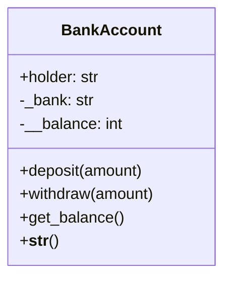
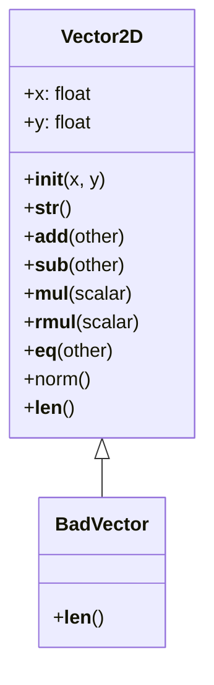
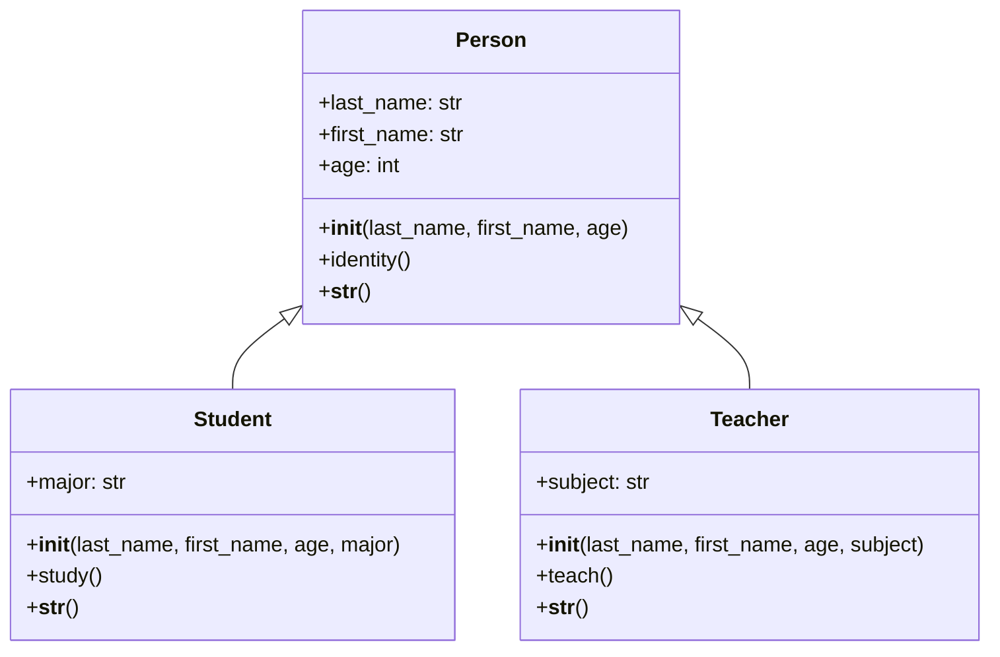
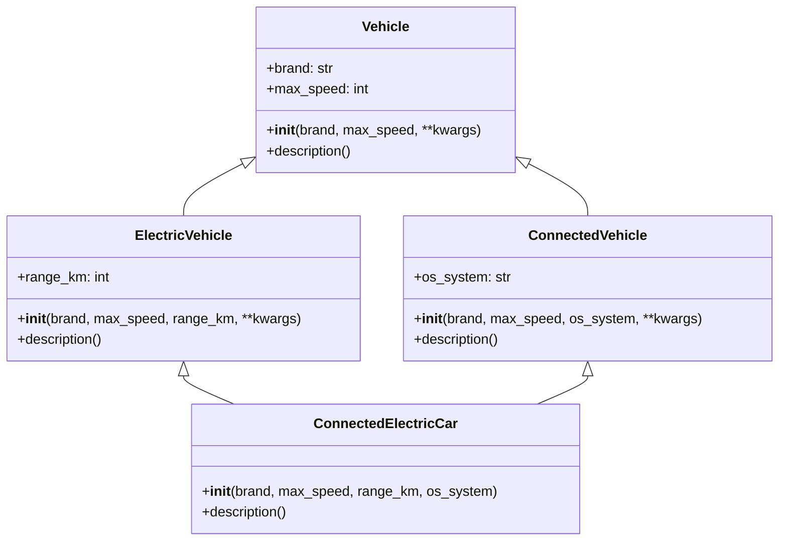
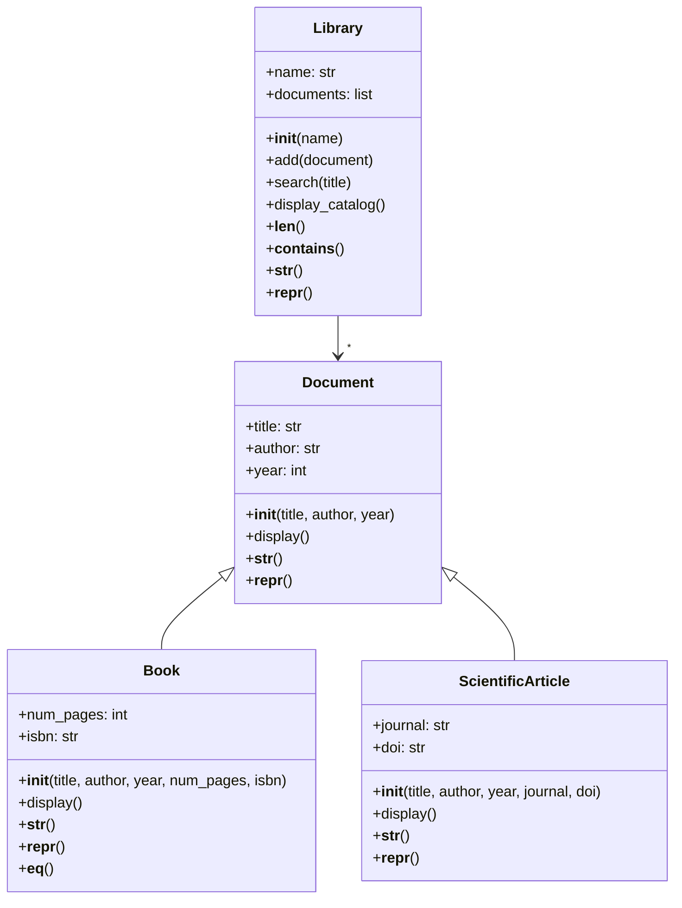

# 🐍 Python Object-Oriented Programming (OOP) Tutorial

<p align="center">
  
  <br>
  
  
  
</p>

> A comprehensive hands-on guide to learning Object-Oriented Programming in Python
> 
> *Designed for French-speaking beginners transitioning to Python*

---

```
    _    ____   ____ ___ ___      _____ _     _____  _   _ 
   / \  / ___| / ___|_ _|_ _|    |  ___| |   |  _\ \ / / |
  / _ \ \___ \| |    | | | |_____| |_  | |    | | \ V /  |
 / ___ \ ___) | |___ | | | |_____|  _| | |___ | |  | |   |
/_/   \_\____/ \____|___|___|    |_|   |_____|___| |_|   |
                                                      
 _____ _   _ ___ ____    _    ____      _    __ _       _   _ _____
|  ___| | | |_ _/ ___|  / \  / ___|    / \  / _| |     | | | |_   _|
| |_  | |_| || |\___ \ / _ \ \___ \   / _ \| |_| |_____| |_| | | | |
|  _| |  _  || | ___) / ___ \ ___) | / ___ \  _| '__|_____|  _  | | | |
|_|   |_| |_|___|____/_/   \_\____/ /_/   \_\_| |_|     |_| |_| |_| |
                                                                       
```

---

## 📚 Table of Contents

1. [Introduction](#-introduction)
2. [Prerequisites & Installation](#-prerequisites--installation)
3. [Project Structure](#-project-structure)
4. [Understanding OOP Fundamentals](#-understanding-oop-fundamentals)
5. [Exercise Files Overview](#-exercise-files-overview)
6. [Running the Exercises](#-running-the-exercises)
7. [Expected Outputs](#-expected-outputs)
8. [UML Class Diagrams](#-uml-class-diagrams)
9. [Key Concepts Summary](#-key-concepts-summary)
10. [Video Resources](#-video-resources)
11. [FAQ & Troubleshooting](#-faq--troubleshooting)

---

## 🌟 Introduction

Welcome to this Python OOP tutorial! This project contains 5 exercises that will teach you the fundamental concepts of Object-Oriented Programming (OOP).

### What is Object-Oriented Programming?

**Object-Oriented Programming (OOP)** is a programming paradigm that organizes code into "objects" - self-contained units that combine data (attributes) and behavior (methods).

```
┌─────────────────────────────────────────────────────────────────┐
│                        OOP CONCEPTS                             │
├─────────────────────────────────────────────────────────────────┤
│                                                                 │
│    ┌──────────────┐     ┌──────────────┐     ┌──────────────┐  │
│    │   CLASS      │     │   OBJECT     │     │  ATTRIBUTE   │  │
│    │  (Blueprint) │────▶│  (Instance)  │────▶│   (Data)     │  │
│    └──────────────┘     └──────────────┘     └──────────────┘  │
│                                                                 │
│    ┌──────────────┐     ┌──────────────┐     ┌──────────────┐  │
│    │   METHOD     │     │ INHERITANCE  │     │  ENCAPSUL.   │  │
│    │  (Behavior)  │     │  (Parent)    │     │  (Privacy)   │  │
│    └──────────────┘     └──────────────┘     └──────────────┘  │
│                                                                 │
└─────────────────────────────────────────────────────────────────┘
```

Think of it like this:
- A **class** is like a blueprint or template (like a car design)
- An **object** is a real instance created from that blueprint (an actual car)
- **Attributes** are the characteristics of an object (color, brand, speed)
- **Methods** are the actions an object can perform (accelerate, brake, honk)

---

## 🗺️ Learning Path

```
EXERCISE 1          EXERCISE 2          EXERCISE 3          EXERCISE 4         PROJECT
   │                   │                   │                   │                  │
   ▼                   ▼                   ▼                   ▼                  ▼
┌─────────┐         ┌─────────┐         ┌─────────┐         ┌─────────┐        ┌─────────┐
│Bank     │         │Vector2D │         │School   │         │Vehicles │        │Library │
│Account  │         │Operator │         │System   │         │Multiple │        │System  │
│         │         │Overload │         │Inherit. │         │Inherit. │        │        │
└─────────┘         └─────────┘         └─────────┘         └─────────┘        └─────────┘
   │                   │                   │                   │                  │
   ▼                   ▼                   ▼                   ▼                  ▼
Encapsulation    Polymorphism       Inheritance         Advanced          Complete
                                   (Single)           Inheritance        Project
```

---

## 💻 Prerequisites & Installation

### Requirements

| Requirement | Version | Description |
|-------------|---------|-------------|
| Python | 3.8+ | The programming language |
| Terminal/Command Prompt | - | To run the programs |

### Installing Python

#### Windows:
```powershell
# Open PowerShell or Command Prompt
# Visit https://www.python.org/downloads/
# Download Python 3.x installer
# IMPORTANT: Check "Add Python to PATH"
python --version
```

#### macOS:
```bash
# Using Homebrew (recommended)
brew install python3

# Verify installation
python3 --version
```

#### Linux (Ubuntu/Debian):
```bash
sudo apt update
sudo apt install python3
python3 --version
```

---

## 📂 Project Structure

```
Python-Practical-Works/
│
├── 📄 README.md                 # This comprehensive guide
│
├── 📄 Exercise .py             # Library System (Final Project)
├── 📄 Exercise 1.py            # Bank Account (Encapsulation)
├── 📄 Exercise 2.py            # Vector2D (Operator Overloading)
├── 📄 Exercise 3.py            # School System (Inheritance)
└── 📄 Exercise 4.py            # Connected Vehicles (Multiple Inheritance)
```

---

## 🧠 Understanding OOP Fundamentals

### The Four Pillars of OOP

```
                    ┌─────────────────┐
                    │      OOP        │
                    └────────┬────────┘
                             │
        ┌────────────────────┼────────────────────┐
        │                    │                    │
        ▼                    ▼                    ▼
┌───────────────┐   ┌───────────────┐   ┌───────────────┐
│ ENCAPSULATION │   │ INHERITANCE   │   │ POLYMORPHISM  │
│   (Security)  │   │  (Reusability)│   │ (Flexibility)│
└───────────────┘   └───────────────┘   └───────────────┘
        │                    │                    │
        │                    └──────────┬──────────┘
        │                               │
        ▼                               ▼
┌───────────────┐               ┌───────────────┐
│   ABSTRACTION│               │    METHODS    │
│ (Simplicity) │               │  (Behavior)   │
└───────────────┘               └───────────────┘
```

### 1. Encapsulation (Exercise 1)

**Definition**: Bundling data and methods together while restricting direct access to some components.

```python
class BankAccount:
    def __init__(self, holder, initial_balance):
        self.holder = holder          # Public - accessible anywhere
        self._bank = "Attijariwafa"  # Protected - internal use convention
        self.__balance = initial_balance  # Private - name mangled
```

```
ACCESS LEVELS:
┌────────────────────────────────────────────┐
│  self.name      → PUBLIC   (everyone)      │
│  self._name     → PROTECTED (class only)  │
│  self.__name    → PRIVATE   (name mangled) │
└────────────────────────────────────────────┘
```

### 2. Inheritance (Exercises 3 & 4)

**Definition**: Creating new classes from existing ones, inheriting their attributes and methods.

```
    Person (Parent/Base)
    ├── Student (Child/Derived)
    └── Teacher (Child/Derived)
```

### 3. Polymorphism (Exercise 2 & 3)

**Definition**: The Same interface, different implementations.

```python
# Same method, different behavior!
len("hello")      # Returns 5 (string length)
len([1,2,3])     # Returns 3 (list length)
len(v1)          # Returns 5 (custom Vector2D length)
```

### 4. Abstraction (All Exercises)

**Definition**: Hiding complex implementation details and showing only the essential features.

---

## 📋 Exercise Files Overview

### 🏦 Exercise 1: Bank Account (Encapsulation)

**File**: `Exercise 1.py`

**Concept**: Learn about encapsulation, access modifiers, and data protection.

**What you'll learn**:
- Creating classes with `__init__` constructor
- Using underscore conventions for data protection
- Creating getter methods
- Understanding name mangling in Python



**Key Concepts**:
```
__init__()     → Constructor - called when object is created
self           → Reference to the current instance
__balance      → Private attribute (name mangled to _BankAccount__balance)
get_balance()  → Getter method to access private data
```

---

### ➗ Exercise 2: Vector2D (Operator Overloading)

**File**: `Exercise 2.py`

**Concept**: Learn about special methods (dunder methods) and operator overloading.

**What you'll learn**:
- `__str__()` - String representation
- `__add__()`, `__sub__()`, `__mul__()` - Arithmetic operators
- `__rmul__()` - Right multiplication
- `__eq__()` - Equality comparison
- `__len__()` - Length function

```python
# These operators are now overloaded!
v1 + v2    # Calls __add__
v1 - v2    # Calls __sub__
v1 * 3     # Calls __mul__
3 * v1     # Calls __rmul__
v1 == v2   # Calls __eq__
len(v1)    # Calls __len__()
```



**Dunder Methods Table**:
| Method | Operator | Example |
|--------|----------|---------|
| `__add__` | `+` | `v1 + v2` |
| `__sub__` | `-` | `v1 - v2` |
| `__mul__` | `*` | `v1 * 3` |
| `__eq__` | `==` | `v1 == v2` |
| `__len__` | `len()` | `len(v1)` |

---

### 🎓 Exercise 3: School System (Inheritance)

**File**: `Exercise 3.py`

**Concept**: Learn about single inheritance and method overriding.

**Inheritance Flow**:
```
         ┌─────────────┐
         │   Person    │  ← Parent Class (Base)
         └──────┬──────┘
                │
        ┌───────┴───────┐
        │               │
   ┌────▼────┐     ┌────▼────┐
   │ Student │     │ Teacher │  ← Child Classes (Derived)
   └─────────┘     └─────────┘
```

```python
# Parent class
class Person:
    def __init__(self, last_name, first_name, age):
        self.last_name = last_name
        self.first_name = first_name
        self.age = age

# Child class - inherits from Person
class Student(Person):
    def __init__(self, last_name, first_name, age, major):
        super().__init__(last_name, first_name, age)  # Call parent
        self.major = major  # Add new attribute
```



**Key Methods**:
- `super().__init__()` - Call parent constructor
- `isinstance(obj, Class)` - Check object type

---

### 🚗 Exercise 4: Connected Vehicles (Multiple Inheritance)

**File**: `Exercise 4.py`

**Concept**: Learn about multiple inheritance and Method Resolution Order (MRO).

**Multiple Inheritance Flow**:
```
           ┌─────────────┐
           │   Vehicle   │  ← Root Class
           └──────┬──────┘
                  │
      ┌───────────┴───────────┐
      │                       │
┌─────▼─────┐           ┌─────▼─────┐
│  Electric │           │ Connected │  ← Multiple Parents
│ Vehicle   │           │ Vehicle   │
└─────┬─────┘           └─────┬─────┘
      │                       │
      └───────────┬───────────┘
                  │
           ┌─────▼─────┐
           │  Connected │  ← Child Class
           │ Electric   │
           │   Car      │
           └───────────┘
```

```python
# Multiple inheritance
class ElectricVehicle(Vehicle):
    # Has electric properties
    pass

class ConnectedVehicle(Vehicle):
    # Has connected features
    pass

# Inherits from BOTH
class ConnectedElectricCar(ElectricVehicle, ConnectedVehicle):
    pass
```

**Method Resolution Order (MRO)**:
```python
ConnectedElectricCar.__mro__
# Shows the order Python looks for methods:
# ConnectedElectricCar → ElectricVehicle → ConnectedVehicle → Vehicle → object
```



---

### 📚 Exercise: Library System (Integrator Project)

**File**: `Exercise .py`

**Concept**: Comprehensive project combining all OOP concepts.

**Class Hierarchy**:
```
       ┌────────────┐
       │  Document  │  ← Abstract Base
       └──────┬─────┘
              │
    ┌─────────┴─────────┐
    │                   │
┌───▼───┐         ┌────▼────┐
│ Book  │         │Article │
└───────┘         └────────┘
     │
     ▼
┌────────────┐
│ Library   │  ← Manages Documents
└───────────┘
```



---

## 🚀 Running the Exercises

### Method 1: Using Command Line

```bash
# Navigate to project directory
cd Python-Practical-Works

# Run each exercise
python Exercise\ 1.py
python Exercise\ 2.py
python Exercise\ 3.py
python Exercise\ 4.py
python "Exercise .py"
```

### Method 2: Run All at Once

```bash
python Exercise\ 1.py && python Exercise\ 2.py && python Exercise\ 3.py && python Exercise\ 4.py && python "Exercise .py"
```

### Method 3: Using VS Code

1. Open the project in VS Code
2. Right-click on any `.py` file
3. Select "Run Python File in Terminal"

---

## 📊 Expected Outputs

### Exercise 1: Bank Account
```
==================================================
EXERCISE 1 - Bank Account
==================================================
Account created: Account of Yasmine | Balance: 5000 MAD
Deposit of 2000 MAD completed
Withdrawal of 1000 MAD completed
Balance via get_balance(): 6000 MAD
Display via print(): Account of Yasmine | Balance: 6000 MAD

Attempt to access account.__balance:
Error: 'BankAccount' object has no attribute '__balance'
```

### Exercise 2: Vector2D
```
==================================================
EXERCISE 2 - Vector2D
==================================================
v1 = (3, 4)
v2 = (1, 2)
v1 + v2 = (4, 6)
v1 - v2 = (2, 2)
v1 * 3 = (9, 12)
3 * v1 = (9, 12)
v1 == v2 ? False
v1 == Vector2D(3,4) ? True
Norm of v1 = 5.00
Length (__len__) of v1 = 5
```

### Exercise 3: School System
```
==================================================
EXERCICE 3 - School System
==================================================
List of people created
Calling identity() on each element:
Last Name: Alaoui, First Name: Yasmine, Age: 20 years
Last Name: Benali, First Name: Omar, Age: 22 years

--- Students ---
Yasmine studies in Computer Science
Student: Yasmine Alaoui, 20 years old, Major: Computer Science

--- Teachers ---
Fatima teaches Python Programming
Teacher: Fatima Chafik, 45 years old, Subject: Python Programming
```

### Exercise 4: Connected Vehicles
```
==================================================
EXERCISE 4 - Connected Vehicles
==================================================
Vehicle Tesla, max speed: 250 km/h | Connected, OS: Tesla OS | 
Electric, range: 500 km | Electric & Connected

MRO of ConnectedElectricCar:
  ConnectedElectricCar
  ElectricVehicle
  ConnectedVehicle
  Vehicle
  object
```

---

## 🔑 Key Concepts Summary

### Access Modifiers in Python

| Prefix | Type | Meaning | Example |
|--------|------|---------|---------|
| None | Public | Accessible anywhere | `self.name` |
| `_` | Protected | Convention for internal use | `self._bank` |
| `__` | Private | Name mangling enabled | `self.__balance` |

### Special Methods (Dunder Methods)

```
┌────────────────────────────────────────────────────────────┐
│                   DUNDER METHODS GUIDE                     │
├──────────────────┬─────────────────────────────────────────┤
│ Method            │ Purpose                                 │
├──────────────────┼─────────────────────────────────────────┤
│ __init__         │ Constructor - object creation          │
│ __str__          │ Human-readable string (print)         │
│ __repr__         │ Developer representation (repr)       │
│ __add__          │ Addition (+) operator                  │
│ __sub__          │ Subtraction (-) operator               │
│ __mul__          │ Multiplication (*) operator            │
│ __eq__           │ Equality (==) operator                 │
│ __len__          │ Length (len()) function                │
│ __contains__     │ Membership (in) operator               │
└──────────────────┴─────────────────────────────────────────┘
```

### Inheritance Keywords

| Keyword | Purpose |
|---------|---------|
| `super()` | Call parent class methods |
| `isinstance(obj, Class)` | Check object type |
| `Class.__mro__` | View Method Resolution Order |

---

## 🎥 Video Resources

> Note: Click the links to watch video tutorials on these concepts.

### Recommended Learning Sequence:

1. **Python OOP Basics**
   - [Python Classes and Objects](https://www.youtube.com/watch?v=apACNr7DC_s)
   - [Python __init__ method](https://www.youtube.com/watch?v=8ok8hJ7D2sE)

2. **Inheritance**
   - [Python Inheritance Explained](https://www.youtube.com/watch?v=RSl87lqOXDE)
   - [Multiple Inheritance in Python](https://www.youtube.com/watch?v=0sD3M7EuzE4)

3. **Advanced OOP**
   - [Python Dunder Methods](https://www.youtube.com/watch?v=z5W3Kqt3y6E)
   - [Python Encapsulation](https://www.youtube.com/watch?v=pE6Yf4jXQ6E)

---

## ❓ FAQ & Troubleshooting

### "Python is not recognized"

**Solution**: Add Python to your system PATH or reinstall with "Add Python to PATH" checked.

### "ModuleNotFoundError"

**Solution**: Make sure you're running from the correct directory.

### "SyntaxError"

**Check for**:
- Missing colons (`:`) after class/function definitions
- Incorrect indentation (Python uses 4 spaces)
- Missing parentheses or brackets

### "NameError: name '_' is not defined"

**Solution**: Check for incomplete lines or invalid syntax like standalone `_`.

---

## 📖 Glossary (French-English)

```
┌─────────────────────────────────────────────────────────────┐
│               OOP VOCABULARY                                │
├──────────────────┬──────────────────┬───────────────────────┤
│ French           │ English          │ Definition            │
├──────────────────┼──────────────────┼───────────────────────┤
│ Classe          │ Class            │ Blueprint for objects │
│ Objet           │ Object           │ Instance of a class   │
│ Héritage        │ Inheritance      │ Child inherits parent │
│ Encapsulation   │ Encapsulation    │ Data + methods bundle │
│ Polymorphisme   │ Polymorphism     │ Many forms            │
│ Abstraction     │ Abstraction      │ Hide complexity       │
│ Méthode         │ Method           │ Function in class     │
│ Attribut        │ Attribute        │ Variable in class     │
│ Constructeur    │ Constructor      │ __init__ method      │
│ Héritage multiple│ Multiple inher. │ Inherit from multiple │
│ Nom protégé     │ Protected name   │ Single underscore     │
│ Nom privé       │ Private name     │ Double underscore     │
└──────────────────┴──────────────────┴───────────────────────┘
```

---

## 🙏 Credits

```
        _   _      _ _         _    ___ ____   ____ ___ ___ 
       | | | |    | | |       | |  |_ _| __ ) / ___|_ _|_ _|
       | |_| |    | | |_____| |_| | || | _ \ \___ \ | | | |
       |  _  |_   | | |_____|  _  | || | |_) |___) | | | |
       |_| |_( )  |_|_|     |_| |_|___|____/|____/|___|___|
       
Created as part of Python OOP course at EMSI
```

---

<p align="center">
  
  
  <br><br>
  <em>Happy Learning! 🚀</em>
</p>
