# 🐍 Ultimate Python OOP Mastery Course

<p align="center">
  <a href="https://www.python.org/">
    
  </a>
  <a href="#">
    
  </a>
  <a href="#">
    
  </a>
  <a href="#">
    
  </a>
  <a href="#">
    
  </a>
</p>

---

<p align="center">
  
</p>

---

## 📑 Table of Contents

1. [🏠 Home](#home)
2. [🎯 Objectives](#objectives)
3. [💻 Environment](#environment)
4. [📂 Structure](#structure)
5. [📖 Methodology](#methodology)
6. [🧠 OOP Theory](#oop-theory)
7. [📝 Exercises](#exercises)
8. [▶️ Run Code](#run-code)
9. [📊 Results](#results)
10. [💡 Reference](#reference)
11. [🎬 Videos](#videos)
12. [❓ Help](#help)
13. [📚 Resources](#resources)

---

## 🏠 Home

### Welcome Banner

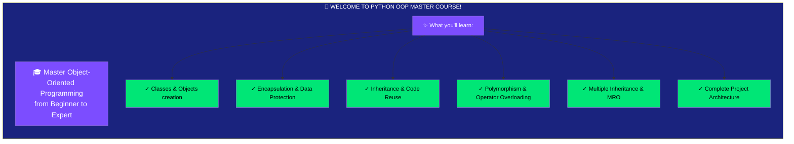

### Course Flow

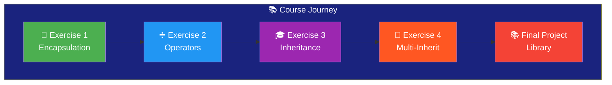

---

## 🎯 Objectives

### Learning Goals Mind Map

```mermaid
mindmap
  root((🎯 OBJECTIVES))
    Master Class Design
      Create classes
      Define constructors
      Object instantiation
    Encapsulation
      Data protection
      Private attributes
      Public methods
    Inheritance
      Single inheritance
      Multiple inheritance
      super() usage
    Polymorphism
      Operator overloading
      Dunder methods
      Method overriding
    Build Projects
      Architecture design
      Complete systems
      Best practices
```

---

## 💻 Environment

### System Requirements

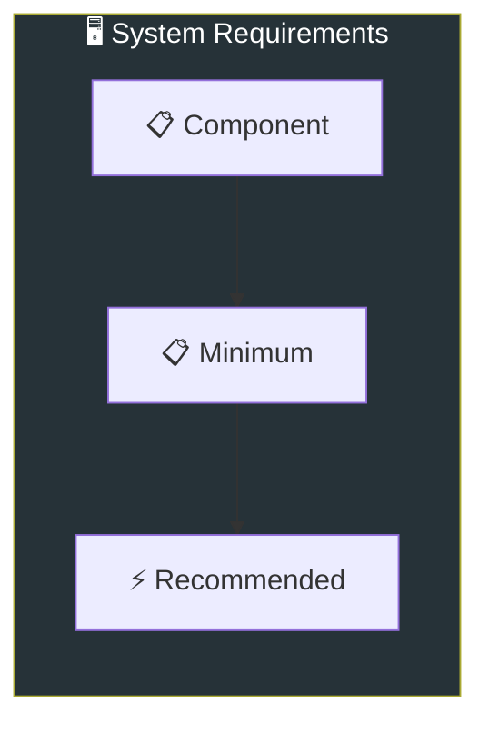

| 🖥️ Component | 📋 Minimum | ⚡ Recommended |
|--------------|------------|----------------|
| **Python** | 3.8 | 3.12+ |
| **RAM** | 4 GB | 8 GB |
| **Storage** | 1 GB | 5 GB |
| **OS** | Windows/Mac/Linux | Win 11/Mac/Ubuntu |

---

## 📂 Structure

### Project Files Tree

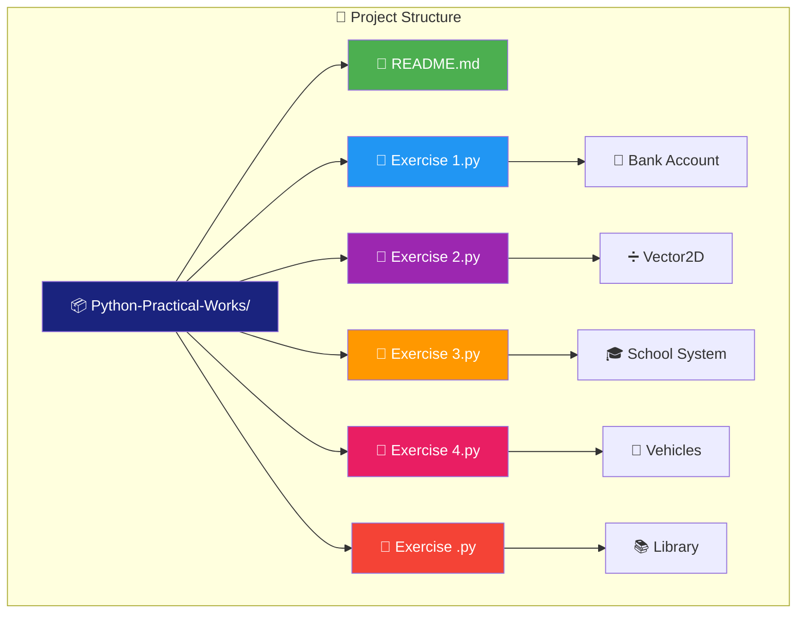

---

## 📖 Methodology

### 6-Step Learning System

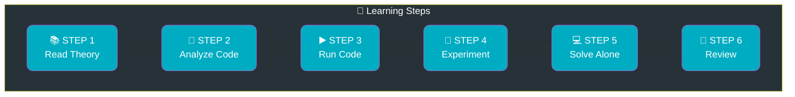

### Time Distribution

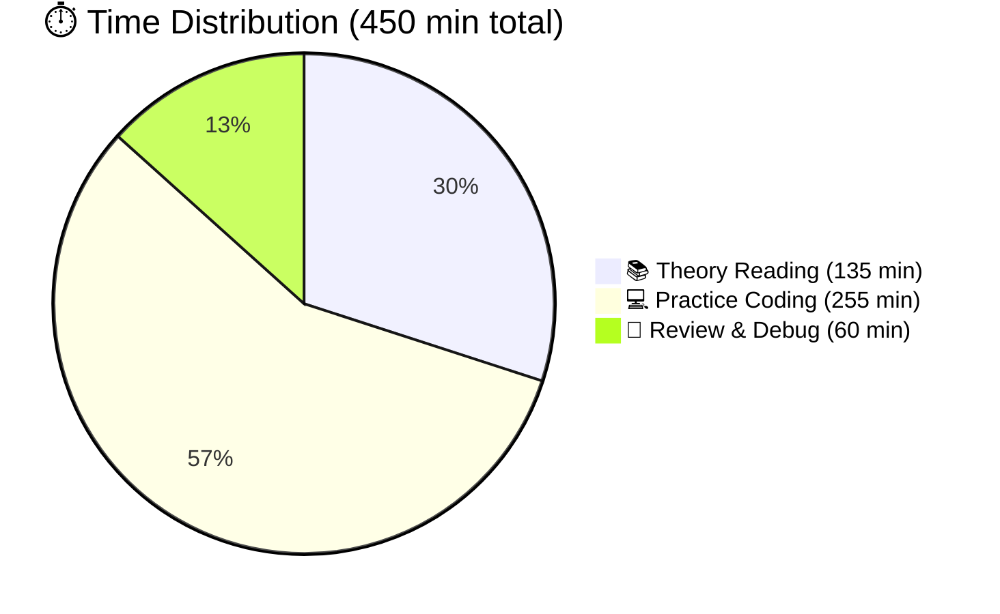

---

## 🧠 OOP Theory

### The 4 Pillars of OOP

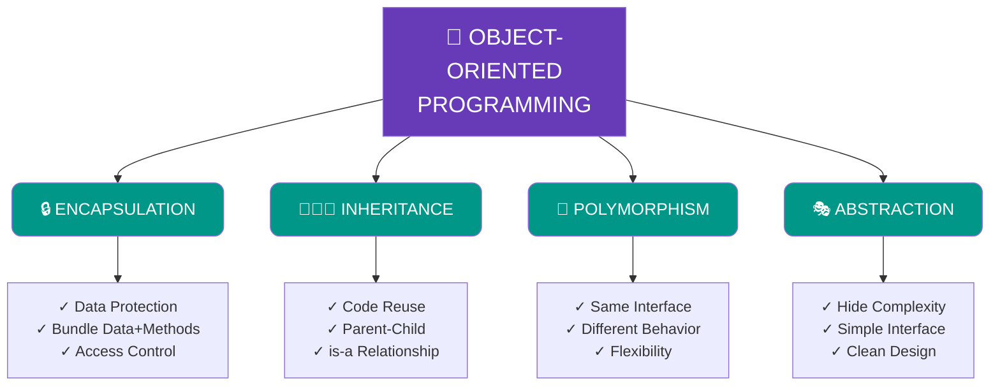

---

## 📝 Exercises

### Exercise 1: Bank Account 🏦

**Level**: ⭐ Beginner | **Focus**: Encapsulation

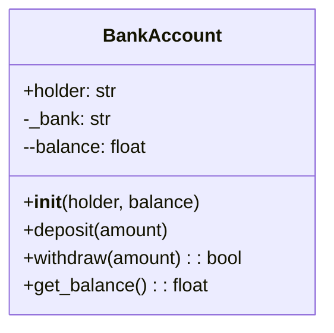

---

### Exercise 2: Vector2D ➗

**Level**: ⭐⭐ Intermediate | **Focus**: Operator Overloading

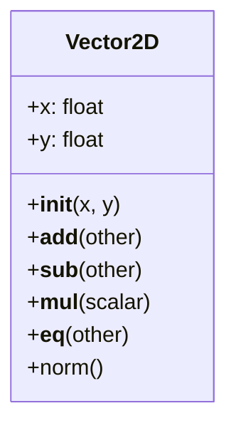

### Operators Reference

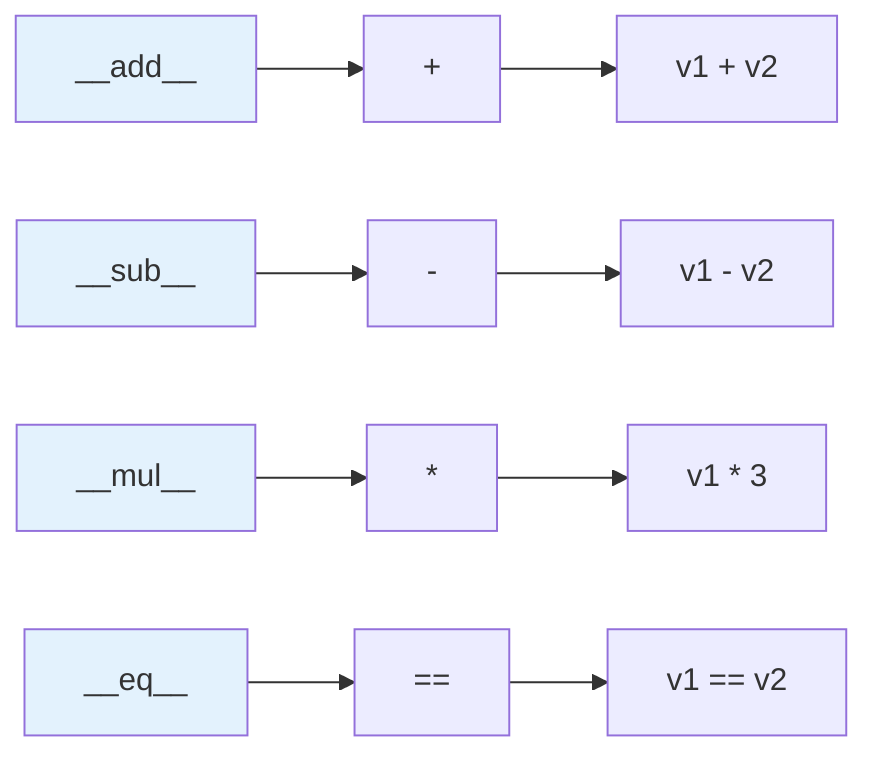

---

### Exercise 3: School System 🎓

**Level**: ⭐⭐ Intermediate | **Focus**: Inheritance

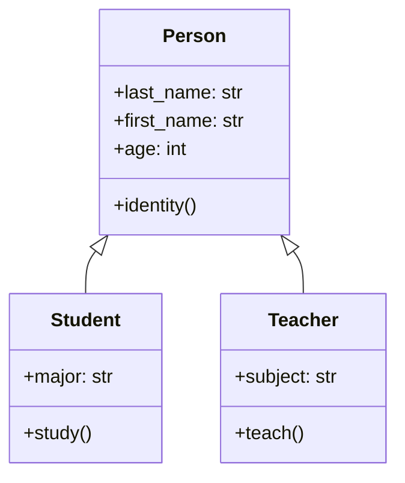

---

### Exercise 4: Vehicles 🚗

**Level**: ⭐⭐⭐ Advanced | **Focus**: Multiple Inheritance

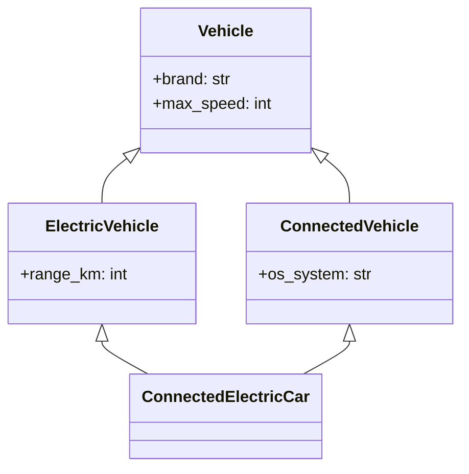

### MRO Visualization

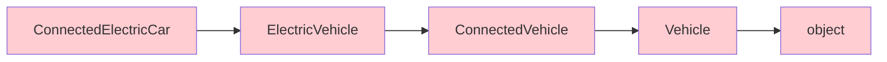

---

### Final Project: Library 📚

**Level**: ⭐⭐⭐⭐ Expert | **Focus**: Complete System

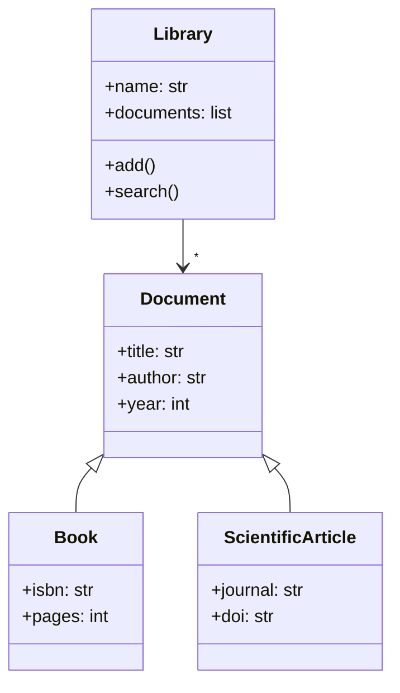

---

## ▶️ Run Code

### Quick Commands

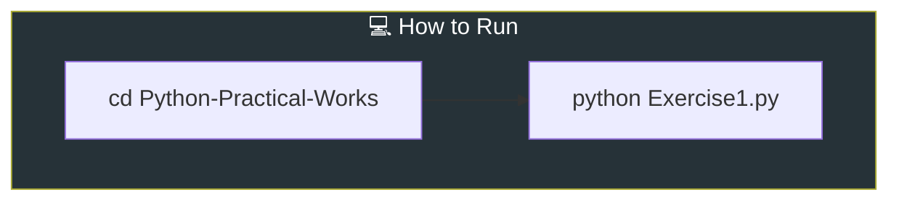

```bash
# 🪟 Windows / 🍎 macOS / 🐧 Linux
cd Python-Practical-Works
python Exercise1.py
python Exercise2.py
python Exercise3.py
python Exercise4.py
python "Exercise .py"
```

---

## 📊 Results

### Expected Outputs

#### 🏦 Exercise 1 Output

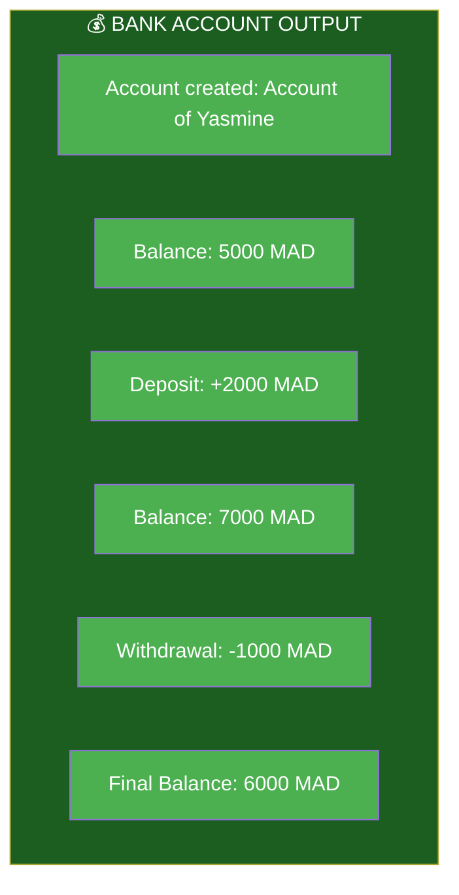

---

## 💡 Reference

### Quick Reference Mind Map

```mermaid
mindmap
  root((💡 KEY CONCEPTS))
    Naming Conventions
      public name
      protected _name
      private __name
    Dunder Methods
      __init__
      __str__
      __add__
    Inheritance
      super()
      isinstance()
      __mro__
```

---

## 🎬 Videos

### Tutorial Videos

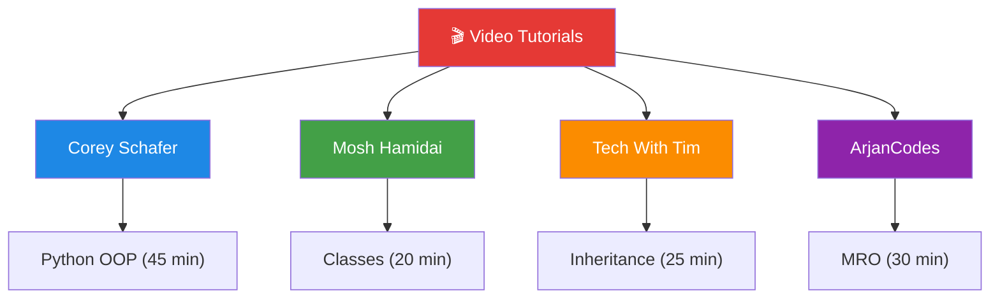

| 📺 Topic | 🔗 Link |
|----------|---------|
| OOP Basics | [Watch](https://www.youtube.com/watch?v=apACNr7DC_s) |
| Classes | [Watch](https://www.youtube.com/watch?v=8ok8hJ7D2sE) |
| Inheritance | [Watch](https://www.youtube.com/watch?v=RSl87lqOXDE) |
| MRO | [Watch](https://www.youtube.com/watch?v=0sD3M7EuzE4) |

---

## ❓ Help

### FAQ Flowchart

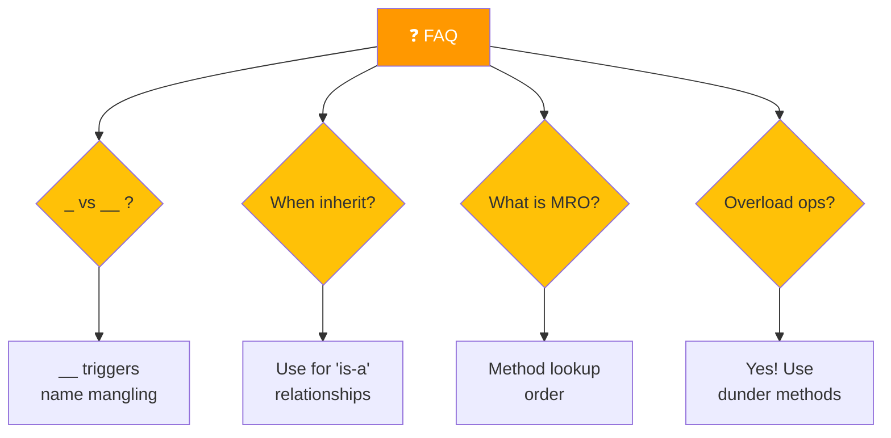

---

## 📚 Resources

### Further Learning Resources

```mermaid
mindmap
  root((📚 MORE RESOURCES))
    Books
      Fluent Python
      Python Crash Course
      Clean Code
    Websites
      Real Python
      Official Docs
      W3Schools
    Practice
      LeetCode
      HackerRank
      Codewars
```

---

<p align="center">
  
  ━━━━━━━━━━━━━━━━━━━━━━━━━━━━━━━━━━━━━━━━━━━━━━━━━━━━━━━━━━━━━━━━━━━━
  
  🎉 THANK YOU FOR USING THIS COURSE! 🎉
  
  ━━━━━━━━━━━━━━━━━━━━━━━━━━━━━━━━━━━━━━━━━━━━━━━━━━━━━━━━━━━━━━━━━━━━
  
  
  
</p>

---

<p align="center">
  <strong>🚀 Happy Coding! Build Something Amazing! 🚀</strong><br>
  <em>⭐ Star this repo if you found it helpful!</em>
</p>

---
