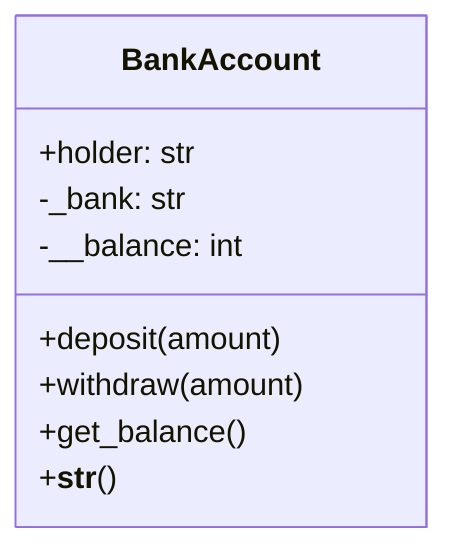
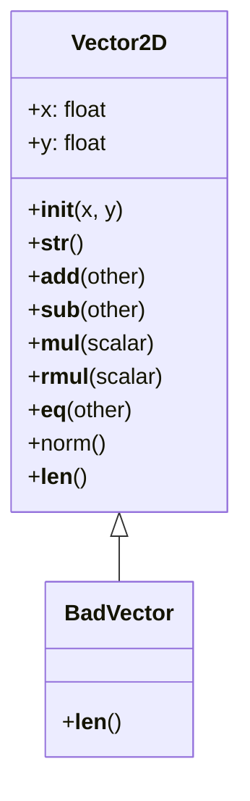
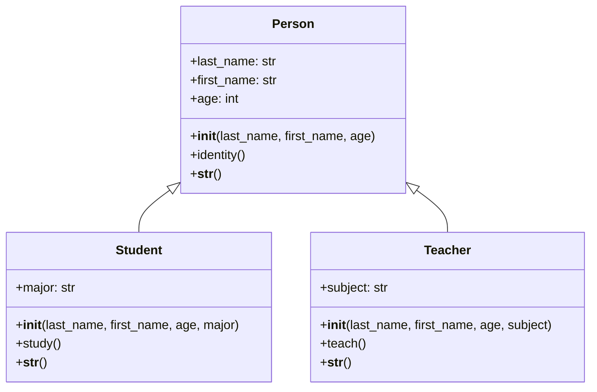
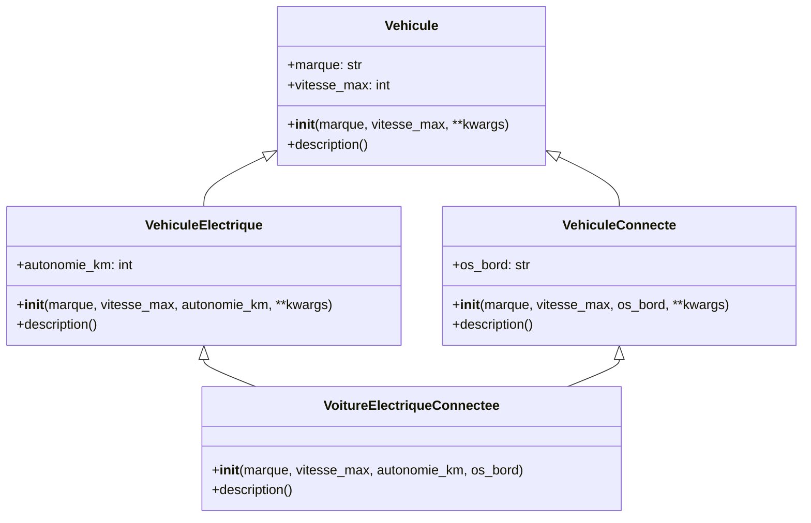
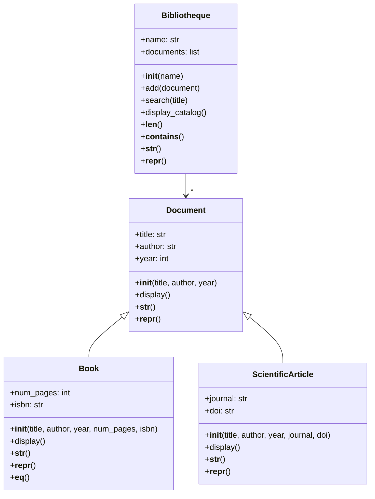

# Python Object-Oriented Programming (OOP) Tutorial

> A comprehensive hands-on guide to learning Object-Oriented Programming in Python
> 
> *Designed for French-speaking beginners transitioning to Python*

---

## 📚 Table of Contents

1. [Introduction](#introduction)
2. [Prerequisites & Installation](#prerequisites--installation)
3. [Project Structure](#project-structure)
4. [Understanding OOP Fundamentals](#understanding-oop-fundamentals)
5. [Exercise Files Overview](#exercise-files-overview)
6. [Running the Exercises](#running-the-exercises)
7. [Expected Outputs](#expected-outputs)
8. [UML Class Diagrams](#uml-class-diagrams)
9. [Key Concepts Summary](#key-concepts-summary)

---

## 🌟 Introduction

Welcome to this Python OOP tutorial! This project contains 5 exercises that will teach you the fundamental concepts of Object-Oriented Programming (OOP) in Python.

### What is Object-Oriented Programming?

**Object-Oriented Programming (OOP)** is a programming paradigm that organizes code into "objects" - self-contained units that combine data (attributes) and behavior (methods).

Think of it like this:
- A **class** is like a blueprint or template (like a car design)
- An **object** is a real instance created from that blueprint (an actual car)
- **Attributes** are the characteristics of an object (color, brand, speed)
- **Methods** are the actions an object can perform (accelerate, brake, honk)

---

## 💻 Prerequisites & Installation

### Requirements

| Requirement | Version | Description |
|-------------|---------|-------------|
| Python | 3.8+ | The programming language |
| Terminal/Command Prompt | - | To run the programs |

### Installing Python

#### Windows:
1. Visit [python.org](https://www.python.org/downloads/)
2. Download the latest Python 3.x installer
3. **IMPORTANT**: Check "Add Python to PATH" during installation
4. Open Command Prompt and verify: `python --version`

#### macOS:
```bash
# Using Homebrew (recommended)
brew install python3

# Verify installation
python3 --version
```

#### Linux (Ubuntu/Debian):
```bash
sudo apt update
sudo apt install python3
python3 --version
```

### Verifying Your Installation

```bash
# Check Python is installed
python --version

# Or on some systems
python3 --version
```

You should see something like: `Python 3.11.4` or higher.

---

## 📂 Project Structure

```
TP PYTHON N°2 Classe et Héritage/
├── Coding/
│   ├── Exercise .py       # Library System (Integrator Project)
│   ├── Exercise 1.py      # Bank Account (Encapsulation)
│   ├── Exercise 2.py     # Vector2D (Operator Overloading)
│   ├── Exercise 3.py     # School System (Inheritance)
│   └── Exercise 4.py     # Connected Vehicles (Multiple Inheritance)
└── README.md             # This file
```

---

## 🧠 Understanding OOP Fundamentals

Before diving into the exercises, let's understand the four pillars of OOP:

### 1. Encapsulation (Exercise 1)

**Definition**: Bundling data and methods together while restricting direct access to some components.

In Python, we use naming conventions:
- `_variable` - "protected" (internal use, convention)
- `__variable` - "private" (name mangling for security)

```python
class BankAccount:
    def __init__(self, holder, initial_balance):
        self.holder = holder          # Public
        self._bank = "Attijariwafa"   # Protected (convention)
        self.__balance = initial_balance  # Private (name mangled)
```

### 2. Inheritance (Exercises 3 & 4)

**Definition**: Creating new classes from existing ones, inheriting their attributes and methods.

```
    Person (Parent)
    ├── Student (Child)
    └── Teacher (Child)
```

The child class inherits all properties from the parent and can add its own.

### 3. Polymorphism (Exercise 2 & 3)

**Definition**: The ability to take many forms - same interface, different implementations.

```python
# Same method, different behavior
len("hello")      # Returns 5 (string length)
len([1,2,3])     # Returns 3 (list length)
len(v1)          # Returns 5 (custom Vector2D length)
```

### 4. Abstraction (All Exercises)

**Definition**: Hiding complex implementation details and showing only the essential features.

---

## 📋 Exercise Files Overview

### Exercise 1: Bank Account (Encapsulation)

**File**: [`Coding/Exercise 1.py`](Coding/Exercise 1.py)

**Concept**: Learn about encapsulation, access modifiers, and data protection.

**What you'll learn**:
- Creating classes with `__init__` constructor
- Using underscore conventions for data protection (`_protected`, `__private`)
- Creating getter methods (`get_balance()`)
- Understanding name mangling in Python



---

### Exercise 2: Vector2D (Operator Overloading)

**File**: [`Coding/Exercise 2.py`](Coding/Exercise 2.py)

**Concept**: Learn about special methods (dunder methods) and operator overloading.

**What you'll learn**:
- `__str__()` - String representation
- `__add__()` - Addition operator (+)
- `__sub__()` - Subtraction operator (-)
- `__mul__()` - Multiplication operator (*)
- `__rmul__()` - Right multiplication (scalar * vector)
- `__eq__()` - Equality operator (==)
- `__len__()` - Length function

```python
# These operators are now overloaded!
v1 + v2    # Calls __add__
v1 - v2    # Calls __sub__
v1 * 3     # Calls __mul__
3 * v1     # Calls __rmul__
v1 == v2   # Calls __eq__
len(v1)    # Calls __len__()
```



---

### Exercise 3: School System (Inheritance)

**File**: [`Coding/Exercise 3.py`](Coding/Exercise 3.py)

**Concept**: Learn about single inheritance and method overriding.

**What you'll learn**:
- Creating child classes
- Using `super().__init__()` to call parent constructors
- Method overriding
- Using `isinstance()` for type checking

```python
# Parent class
class Person:
    def __init__(self, last_name, first_name, age):
        self.last_name = last_name
        self.first_name = first_name
        self.age = age

# Child class - inherits from Person
class Student(Person):
    def __init__(self, last_name, first_name, age, major):
        super().__init__(last_name, first_name, age)  # Call parent
        self.major = major  # Add new attribute
```



---

### Exercise 4: Connected Vehicles (Multiple Inheritance)

**File**: [`Coding/Exercise 4.py`](Coding/Exercise 4.py)

**Concept**: Learn about multiple inheritance and Method Resolution Order (MRO).

**What you'll learn**:
- Multiple inheritance (a class inheriting from multiple parents)
- Using `**kwargs` for flexible parameter passing
- Method Resolution Order (MRO)
- Cooperative multiple inheritance with `super()`

```python
# Multiple inheritance
class ElectricVehicle(Vehicule):
    # Has electric properties
    pass

class ConnectedVehicle(Vehicule):
    # Has connected features
    pass

# Inherits from BOTH
class ConnectedElectricCar(ElectricVehicle, ConnectedVehicle):
    pass
```



---

### Exercise: Library System (Integrator Project)

**File**: [`Coding/Exercise .py`](Coding/Exercise%20.py)

**Concept**: Comprehensive project combining all OOP concepts.

**What you'll learn**:
- Abstract document hierarchy (Document > Book, Article)
- Library management system
- Custom exceptions
- Collection operators (`in`, `len()`)



---

## 🚀 Running the Exercises

### Method 1: Using Command Line

Navigate to the project directory and run each exercise:

```bash
# Windows
cd "d:\Travaille EMSI\Python\TP PYTHON N°2 Classe et Héritage"
python Coding\Exercise 1.py

# macOS/Linux
cd /path/to/project
python3 Coding/Exercise\ 1.py
```

### Method 2: Running All Exercises at Once

```bash
# Run all exercises sequentially
python Coding/Exercise\ 1.py && python Coding/Exercise\ 2.py && python Coding/Exercise\ 3.py && python Coding/Exercise\ 4.py && python "Coding/Exercise .py"
```

### Method 3: Using an IDE (VS Code)

1. Open the project in VS Code
2. Right-click on any exercise file
3. Select "Run Python File in Terminal"

---

## 📊 Expected Outputs

### Exercise 1: Bank Account

```
==================================================
EXERCISE 1 - Bank Account
==================================================
Account created: Account of Yasmine | Balance: 5000 MAD
Deposit of 2000 MAD completed
Withdrawal of 1000 MAD completed
Balance via get_balance(): 6000 MAD
Display via print(): Account of Yasmine | Balance: 6000 MAD

Attempt to access account.__balance:
Error: 'BankAccount' object has no attribute '__balance'
Explanation: __balance is a private attribute, it is 'name mangled' to _BankAccount__balance
Access possible via: 6000 (but this is not recommended)
```

### Exercise 2: Vector2D

```
==================================================
EXERCISE 2 - Vector2D
==================================================
v1 = (3, 4)
v2 = (1, 2)
v1 + v2 = (4, 6)
v1 - v2 = (2, 2)
v1 * 3 = (9, 12)
3 * v1 = (9, 12)
v1 == v2 ? False
v1 == Vector2D(3,4) ? True
Norm of v1 = 5.00
Length (__len__) of v1 = 5

Test __len__ with float return:
Error: 'float' object cannot be interpreted as an integer
```

### Exercise 3: School System

```
==================================================
EXERCISE 3 - School System
==================================================
List of people created

Calling identity() on each element:
Last Name: Alaoui, First Name: Yasmine, Age: 20 years
Last Name: Benali, First Name: Omar, Age: 22 years
Last Name: Chafik, First Name: Fatima, Age: 45 years
Last Name: El Fassi, First Name: Mohammed, Age: 52 years

Separation with isinstance():

--- Students ---
Yasmine studies in Computer Science
Student: Yasmine Alaoui, 20 years old, Major: Computer Science
Omar studies in Mathematics
Student: Omar Benali, 22 years old, Major: Mathematics

--- Teachers ---
Fatima teaches Python Programming
Teacher: Fatima Chafik, 45 years old, Subject: Python Programming
Mohammed teaches Database
Teacher: Mohammed El Fassi, 52 years old, Subject: Database
```

### Exercise 4: Connected Vehicles

```
==================================================
EXERCISE 4 - Connected Vehicles
==================================================
Vehicle Tesla, max speed: 250 km/h | Connected, OS: Tesla OS | Electric, range: 500 km | Electric & Connected

MRO of ConnectedElectricCar:
  ConnectedElectricCar
  ElectricVehicle
  ConnectedVehicle
  Vehicle
  object
```

---

## 🔍 Key Concepts Summary

### Access Modifiers in Python

| Prefix | Type | Meaning | Example |
|--------|------|---------|---------|
| None | Public | Accessible anywhere | `self.name` |
| `_` | Protected | Convention for internal use | `self._bank` |
| `__` | Private | Name mangling enabled | `self.__balance` |

### Special Methods (Dunder Methods)

| Method | Operator/Function | Purpose |
|--------|------------------|---------|
| `__init__` | - | Constructor, called when creating object |
| `__str__` | `print(obj)` | Human-readable string |
| `__repr__` | `repr(obj)` | Developer representation |
| `__add__` | `+` | Addition |
| `__sub__` | `-` | Subtraction |
| `__mul__` | `*` | Multiplication |
| `__rmul__` | `*` (reversed) | Right multiplication |
| `__eq__` | `==` | Equality comparison |
| `__len__` | `len(obj)` | Length |
| `__contains__` | `in` | Membership test |

### Inheritance Keywords

| Keyword | Purpose |
|---------|---------|
| `super()` | Call parent class methods |
| `isinstance(obj, Class)` | Check if object is instance of class |
| `Class.__mro__` | View Method Resolution Order |

---

## 📖 Code Block Explanations

### Example: Understanding `__init__`

```python
class BankAccount:
    def __init__(self, holder, initial_balance):
        # __init__ is called when you create a new object
        # BankAccount("Yasmine", 5000) triggers this
        
        self.holder = holder              # Store holder name
        self.__balance = initial_balance # Store initial balance
```

### Example: Understanding `super()`

```python
class Student(Person):
    def __init__(self, last_name, first_name, age, major):
        # super() calls the parent class's __init__ method
        # This ensures the Person part is properly initialized
        super().__init__(last_name, first_name, age)
        
        # Then we add our own initialization
        self.major = major
```

### Example: Understanding `**kwargs`

```python
class Vehicle:
    def __init__(self, brand, max_speed, **kwargs):
        # **kwargs captures any additional keyword arguments
        # This is useful for multiple inheritance
        super().__init__(**kwargs)  # Pass them to parent
        self.brand = brand
        self.max_speed = max_speed
```

---

## 🎓 Learning Path

For beginners, we recommend the following order:

1. **Exercise 1** - Learn basic class structure and encapsulation
2. **Exercise 2** - Understand special methods and operator overloading
3. **Exercise 3** - Master single inheritance
4. **Exercise 4** - Tackle multiple inheritance (advanced)
5. **Library Project** - Combine all concepts

---

## 🔧 Troubleshooting

### "Python is not recognized"

Make sure Python is added to your system PATH. Reinstall with "Add Python to PATH" checked.

### "ModuleNotFoundError"

Make sure you're running from the correct directory.

### "SyntaxError"

Check for:
- Missing colons (`:`) after class and function definitions
- Incorrect indentation (Python uses 4 spaces)
- Missing parentheses or brackets

---

## 📝 Glossary (French-English)

| French | English |
|--------|---------|
| Classe | Class |
| Objet | Object |
| Héritage | Inheritance |
| Encapsulation | Encapsulation |
| Polymorphisme | Polymorphism |
| Abstraction | Abstraction |
| Méthode | Method |
| Attribut | Attribute |
| Constructeur | Constructor |
| Héritage multiple | Multiple inheritance |
| Nom protégé | Protected name |
| Nom privé | Private name |

---

## 🙏 Credits

Created as part of Python OOP course at EMSI.

---

*Happy Learning! 🚀*
