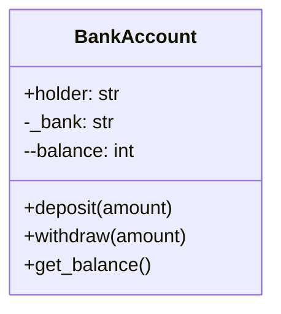
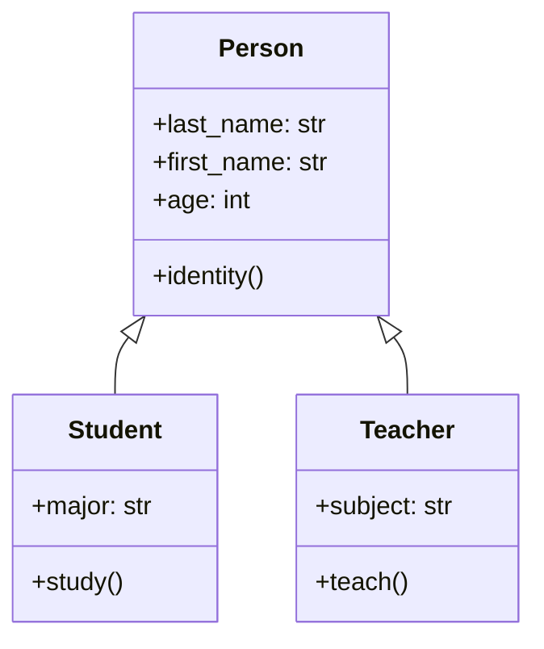
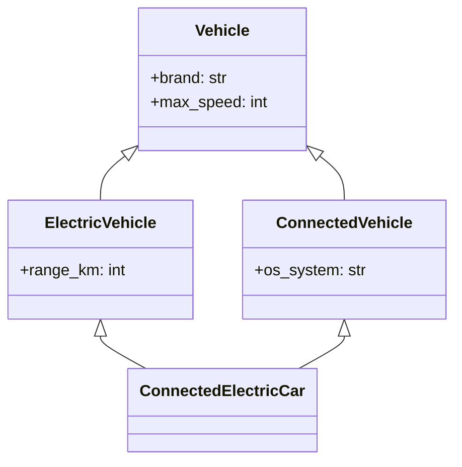

# 🐍 Python Object-Oriented Programming (OOP) Tutorial

<p align="center">
  
  <br><br>
  
  
  
  
</p>

> ## 🎯 Complete Guide to Object-Oriented Programming in Python
> *Designed specifically for French-speaking beginners transitioning to Python*

---

```
░█▀▀░█▀█░█▀▄░█▀▀░█▀▄░█▀█░█▀▄░█▀█░█▀▄░█▀▀
░█▀▀░█▀█░█▀▄░█▀▀░█▀▄░█▀█░█▀▄░█▀█░█▀▄░█▀▀
░▀▀▀░▀░▀░▀▀▀░▀░▀░▀░▀░▀▀▀░▀░▀░▀▀▀░▀▀▀
         OOP TUTORIAL
░█▀▀░█▀█░█▀▄░█▀▀░█▀▄░█▀█░█▀▄░█▀█░█▀▄░█▀▀
░█▀▀░█▀█░█▀▄░█▀▀░█▀▄░█▀█░█▀▄░█▀█░█▀▄░█▀▀
░▀▀▀░▀░▀░▀▀▀░▀░▀░▀░▀░▀▀▀░▀░▀░▀▀▀░▀▀▀
```

---

## 📋 Table of Contents

1. [🚀 Quick Start](#-quick-start)
2. [📚 Course Overview](#-course-overview)
3. [💻 Prerequisites](#-prerequisites)
4. [🏗️ Project Structure](#-project-structure)
5. [🧠 OOP Fundamentals](#-oop-fundamentals)
6. [📝 Exercise Details](#-exercise-details)
7. [▶️ Running Exercises](#-running-exercises)
8. [📤 Expected Outputs](#-expected-outputs)
9. [🔧 Key Concepts](#-key-concepts)
10. [🎥 Video Resources](#-video-resources)
11. [❓ FAQ](#-faq)

---

## 🚀 Quick Start

```bash
# Clone or download this repository
# Then run any exercise:

python Exercise1.py      # Bank Account (Encapsulation)
python Exercise2.py      # Vector2D (Operators)
python Exercise3.py      # School System (Inheritance)
python Exercise4.py     # Vehicles (Multiple Inheritance)
python "Exercise .py"   # Library System (Project)
```

> ⏱️ **Estimated Completion Time**: 2-3 hours for beginners

---

## 📚 Course Overview

```
┌─────────────────────────────────────────────────────────────────────────────┐
│                        YOUR LEARNING JOURNEY                                │
├─────────────────────────────────────────────────────────────────────────────┤
│                                                                             │
│  ┌──────────┐    ┌──────────┐    ┌──────────┐    ┌──────────┐   ┌──────┐ │
│  │ EXERCISE │    │ EXERCISE │    │ EXERCISE │    │ EXERCISE │   │ FINAL│ │
│  │    1     │ ➜  │    2     │ ➜  │    3     │ ➜  │    4     │ ➜ │PROJCT│ │
│  └────┬─────┘    └────┬─────┘    └────┬─────┘    └────┬─────┘   └──┬───┘ │
│       │               │               │               │          │       │
│       ▼               ▼               ▼               ▼          ▼       │
│  ┌─────────┐     ┌─────────┐     ┌─────────┐     ┌────────┐  ┌───────┐ │
│  │🏦 Bank  │     │➗Vector │     │🎓 School│     │🚗Vehicle│  │📚 Lib │ │
│  │Account  │     │   2D   │     │ System  │     │sConnect.│  │rary  │ │
│  └─────────┘     └─────────┘     └─────────┘     └────────┘  └───────┘ │
│                                                                             │
│  Encapsulation  Polymorphism  Inheritance     Multiple     All OOP   │
│                                   (Single)   Inheritance   Concepts   │
│                                                                             │
└─────────────────────────────────────────────────────────────────────────────┘
```

### What You'll Learn:

| Exercise | Topic | Key Concepts |
|----------|-------|--------------|
| 1 | Bank Account | Encapsulation, Private/Public attributes, Getters |
| 2 | Vector2D | Dunder methods, Operator overloading |
| 3 | School System | Inheritance, super(), isinstance() |
| 4 | Vehicles | Multiple inheritance, MRO, **kwargs |
| Final | Library | Complete OOP project |

---

## 💻 Prerequisites

### Required Tools:

```
┌────────────────────────────────────────────────────────────┐
│                    INSTALLATION CHECKLIST                   │
├────────────────────────────────────────────────────────────┤
│                                                            │
│  ☐ Python 3.8 or higher                                   │
│     ├── Windows: python.org/downloads                      │
│     ├── Mac: brew install python3                          │
│     └── Linux: sudo apt install python3                   │
│                                                            │
│  ☐ Text Editor (VS Code recommended)                      │
│     └── Download: code.visualstudio.com                    │
│                                                            │
│  ☐ Terminal/Command Prompt                                │
│                                                            │
└────────────────────────────────────────────────────────────┘
```

### Verify Installation:

```bash
# Check Python version
python --version    # Should show Python 3.8+

# Check pip is installed
pip --version
```

---

## 🏗️ Project Structure

```
Python-Practical-Works/
│
├── 📄 README.md              # ⭐ You are here! (Comprehensive guide)
│
├── 📄 Exercise 1.py         # 🏦 Bank Account - Encapsulation
│   ├── BankAccount class
│   ├── deposit() / withdraw() methods
│   └── Private attributes (__balance)
│
├── 📄 Exercise 2.py         # ➗ Vector2D - Operator Overloading
│   ├── Vector2D class
│   ├── __add__, __sub__, __mul__, __eq__
│   └── norm() / __len__ methods
│
├── 📄 Exercise 3.py         # 🎓 School System - Inheritance
│   ├── Person (parent)
│   ├── Student (child)
│   └── Teacher (child)
│
├── 📄 Exercise 4.py         # 🚗 Vehicles - Multiple Inheritance
│   ├── Vehicle (root)
│   ├── ElectricVehicle
│   ├── ConnectedVehicle
│   └── ConnectedElectricCar
│
└── 📄 Exercise .py          # 📚 Library - Complete Project
    ├── Document (base class)
    ├── Book / ScientificArticle
    └── Library management system
```

---

## 🧠 OOP Fundamentals

### The Four Pillars:

```
                    ┌──────────────────┐
                    │       OOP        │
                    └────────┬─────────┘
                             │
        ┌────────────────────┼────────────────────┐
        │                    │                    │
        ▼                    ▼                    ▼
┌───────────────┐    ┌───────────────┐    ┌───────────────┐
│   ENCAPSU-    │    │   INHERI-    │    │   POLYMOR-    │
│   LATION      │    │   TANCE      │    │   PHISM       │
│   Security    │    │   Reuse      │    │   Flexibility │
└───────┬───────┘    └───────┬───────┘    └───────┬───────┘
        │                    │                    │
        │                    └────────┬────────────┘
        │                             │
        ▼                             ▼
┌───────────────┐            ┌───────────────┐
│   ABSTRAC-    │            │    METHODS    │
│   TION        │            │   Behavior    │
│  Simplicity   │            └───────────────┘
└───────────────┘
```

### 1. Encapsulation (Exercise 1)

> *"Protect your data like you protect your phone!"*

```python
class BankAccount:
    def __init__(self, holder, balance):
        self.holder = holder        # 📢 Public - everyone sees
        self._bank = "Bank"        # 🔒 Protected - be careful
        self.__balance = balance    # 🔐 Private - hidden!
```

**Access Levels:**
```
┌────────────────────────────────────────────────┐
│  self.name    →  PUBLIC    👁️  See anything   │
│  self._name   →  PROTECTED ⚠️  Use carefully │
│  self.__name  →  PRIVATE   🚫  Hidden!       │
└────────────────────────────────────────────────┘
```

### 2. Inheritance (Exercise 3)

> *"Like traits: you inherit your parents' features!"*

```python
class Person:           # 👨‍👩‍👧 Parent/Base Class
    name = "Unknown"

class Student(Person):  # 👨‍🎓 Child Class
    major = "Science"  # + Inherits 'name' from Person
```

### 3. Polymorphism (Exercise 2)

> *"Same action, different results!"*

```python
len("hello")    # → 5  (characters)
len([1,2,3])   # → 3  (items)
len(v1)         # → 5  (vector length)
```

### 4. Abstraction (All Exercises)

> *"Simple interface, complex inside!"*

```python
# You just call this:
account.deposit(1000)

# But behind the scenes... 💭
# validation, logging, security checks happen automatically!
```

---

## 📝 Exercise Details

### 🏦 Exercise 1: Bank Account

**File:** `Exercise 1.py`

**Learn:**
- Creating classes and objects
- Constructor `__init__`
- Private attributes (`__balance`)
- Getter methods (`get_balance()`)
- Name mangling in Python

**Code Preview:**
```python
class BankAccount:
    def __init__(self, holder, initial_balance):
        self.holder = holder 
        self.__balance = initial_balance  # Private!
    
    def deposit(self, amount):
        if amount > 0:
            self.__balance += amount
            print(f"Deposited {amount} MAD")
```

**UML Diagram:**


---

### ➗ Exercise 2: Vector2D

**File:** `Exercise 2.py`

**Learn:**
- Dunder (double underscore) methods
- Operator overloading
- `__str__`, `__repr__`
- Mathematical operations

**Code Preview:**
```python
class Vector2D:
    def __init__(self, x=0, y=0):
        self.x = x
        self.y = y
    
    def __add__(self, other):
        return Vector2D(self.x + other.x, self.y + other.y)
    
    def __str__(self):
        return f"({self.x}, {self.y})"
```

**Operators Table:**
| Method | Operator | Example |
|--------|----------|---------|
| `__add__` | `+` | `v1 + v2` |
| `__sub__` | `-` | `v1 - v2` |
| `__mul__` | `*` | `v1 * 3` |
| `__eq__` | `==` | `v1 == v2` |
| `__len__` | `len()` | `len(v1)` |

---

### 🎓 Exercise 3: School System

**File:** `Exercise 3.py`

**Learn:**
- Single inheritance
- `super()` function
- Method overriding
- `isinstance()` function

**Inheritance Hierarchy:**


---

### 🚗 Exercise 4: Connected Vehicles

**File:** `Exercise 4.py`

**Learn:**
- Multiple inheritance
- Method Resolution Order (MRO)
- `**kwargs` usage
- Diamond problem

**Complex Inheritance:**


**MRO Visualization:**
```
ConnectedElectricCar
       │
       ├──→ ElectricVehicle ──→ ConnectedVehicle ──→ Vehicle ──→ object
       │
       └──→ ConnectedVehicle ──→ Vehicle ──→ object
```

---

### 📚 Final Project: Library System

**File:** `Exercise .py`

**Concepts Used:**
- Class hierarchy
- Multiple inheritance
- Collection operators
- Type checking
- Custom exceptions

---

## ▶️ Running Exercises

### Method 1: Command Line

```bash
# Windows
cd Python-Practical-Works
python Exercise1.py

# Mac/Linux
python3 Exercise1.py
```

### Method 2: Run All

```bash
python Exercise1.py && python Exercise2.py && python Exercise3.py && python Exercise4.py && python "Exercise .py"
```

### Method 3: VS Code

1. Open VS Code
2. File → Open Folder → Select project
3. Right-click any `.py` file
4. Run "Run Python File in Terminal"

---

## 📤 Expected Outputs

### Exercise 1 Output:
```
==================================================
EXERCISE 1 - Bank Account
==================================================
Account created: Account of Yasmine | Balance: 5000 MAD
Deposit of 2000 MAD completed
Withdrawal of 1000 MAD completed
Balance via get_balance(): 6000 MAD
```

### Exercise 2 Output:
```
==================================================
EXERCISE 2 - Vector2D
==================================================
v1 = (3, 4)
v2 = (1, 2)
v1 + v2 = (4, 6)
v1 - v2 = (2, 2)
v1 * 3 = (9, 12)
Norm of v1 = 5.00
```

### Exercise 3 Output:
```
==================================================
EXERCISE 3 - School System
==================================================
Last Name: Alaoui, First Name: Yasmine, Age: 20 years
Yasmine studies in Computer Science
Student: Yasmine Alaoui, 20 years old, Major: Computer Science
```

### Exercise 4 Output:
```
==================================================
EXERCISE 4 - Connected Vehicles
==================================================
Vehicle Tesla, max speed: 250 km/h | Connected, OS: Tesla OS | 
Electric, range: 500 km | Electric & Connected

MRO: ConnectedElectricCar → ElectricVehicle → ConnectedVehicle → Vehicle → object
```

---

## 🔧 Key Concepts Reference

### Python Naming Conventions:

| Convention | Example | Meaning |
|------------|---------|---------|
| `variable` | `self.name` | Public |
| `_variable` | `self._bank` | Protected |
| `__variable` | `self.__balance` | Private |

### Important Dunder Methods:

```python
# Creation & Destruction
__init__()      # Object creation
__del__()       # Object deletion

# String Representation
__str__()       # print(obj)
__repr__()      # repr(obj)

# Arithmetic Operators
__add__()       # +
__sub__()       # -
__mul__()       # *

# Comparison
__eq__()        # ==
__lt__()        # <
__gt__()        # >

# Collection
__len__()       # len(obj)
__contains__()  # item in obj
```

### Inheritance Functions:

```python
super()              # Call parent method
isinstance(obj, C)   # Check type
issubclass(C1, C2)   # Check inheritance
ClassName.__mro__    # View method resolution
```

---

## 🎥 Video Resources

| Topic | Recommended Video |
|-------|------------------|
| Python OOP Basics | [Corey Schafer - OOP](https://www.youtube.com/watch?v=apACNr7DC_s) |
| Classes & Objects | [Python Tutorial](https://www.youtube.com/watch?v=8ok8hJ7D2sE) |
| Inheritance | [Programming with Mosh](https://www.youtube.com/watch?v=RSl87lqOXDE) |
| Multiple Inheritance | [Tech With Tim](https://www.youtube.com/watch?v=0sD3M7EuzE4) |
| Dunder Methods | [ArjanCodes](https://www.youtube.com/watch?v=z5W3Kqt3y6E) |

---

## ❓ FAQ

### Q: What is `self`?
**A:** `self` refers to the current object instance.

### Q: Why use `__` before a variable?
**A:** It makes the variable private (name mangling).

### Q: What is MRO?
**A:** Method Resolution Order - the order Python looks for methods in multiple inheritance.

### Q: When to use `super()`?
**A:** Always in child classes to properly initialize parent classes.

### Q: What are dunder methods?
**A:** Methods with double underscores (e.g., `__init__`) - also called "magic methods".

---

## 📖 French-English Glossary

| Français | English |
|----------|---------|
| Classe | Class |
| Objet | Object |
| Héritage | Inheritance |
| Encapsulation | Encapsulation |
| Polymorphisme | Polymorphism |
| Méthode | Method |
| Attribut | Attribute |
| Constructeur | Constructor |
| Héritage multiple | Multiple inheritance |

---

## 👏 Thank You!

```
░█▀▀░█▀█░█▀▄░█▀▀░█▀▄░█▀█░█▀▄░█▀█░█▀▄░█▀▀
░█▀▀░█▀█░█▀▄░█▀▀░█▀▄░█▀█░█▀▄░█▀█░█▀▄░█▀▀
░▀▀▀░▀░▀░▀▀▀░▀░▀░▀░▀░▀▀▀░▀░▀░▀▀▀░▀▀▀
      HAPPY CODING! 🎉
░█▀▀░█▀█░█▀▄░█▀▀░█▀▄░█▀█░█▀▄░█▀█░█▀▄░█▀▀
░█▀▀░█▀█░█▀▄░█▀▀░█▀▄░█▀█░█▀▄░█▀█░█▀▄░█▀▀
░▀▀▀░▀░▀░▀▀▀░▀░▀░▀░▀░▀▀▀░▀░▀░▀▀▀░▀▀▀
```

<p align="center">
  
  
  <br><br>
  <em>Created for EMSI Python Course | Bonne chance! 🍀</em>
</p>
