# 🐍 Python Object-Oriented Programming: Complete Mastery Course

<p align="center">
  <a href="https://www.python.org/">
    
  </a>
  <a href="#">
    
  </a>
  <a href="#">
    
  </a>
  <a href="#">
    
  </a>
  <a href="#">
    
  </a>
</p>

---

<p align="center">
  
</p>

---

## 📋 Table of Contents

1. [📖 Introduction](#1-简介)
2. [🎯 Objectives](#2-学习目标)
3. [📦 Prerequisites](#3-环境配置)
4. [🏗️ Project Structure](#4-项目结构)
5. [💡 Working Methodology](#5-工作方法论)
6. [🧠 OOP Fundamentals](#6-面向对象基础)
7. [📝 Exercises Detail](#7-练习详解)
8. [🚀 Running Exercises](#8-运行练习)
9. [📤 Expected Outputs](#9-预期输出)
10. [🔑 Key Concepts](#10-关键概念)
11. [🎥 Video Resources](#11-视频资源)
12. [❓ FAQ](#12-常见问题)
13. [📚 Additional Resources](#13-附加资源)

---

## 1. 📖 Introduction

### Course Overview

This comprehensive course provides a **complete mastery of Object-Oriented Programming (OOP)** using Python. Through hands-on exercises, you will learn fundamental and advanced OOP concepts that are essential for building robust, scalable, and maintainable applications.

> **Target Audience**: Developers looking to strengthen their Python OOP skills
> 
> **Prerequisites**: Basic Python knowledge
> 
> **Learning Format**: Self-paced with hands-on exercises

---

## 2. 🎯 Objectives

### Learning Outcomes


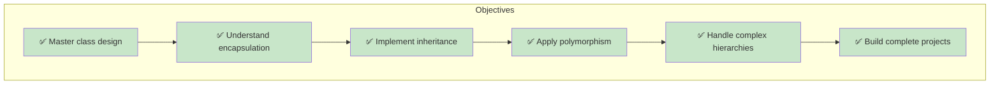

### Skills You Will Gain

```mermaid
mindmap
  root((Skills))
    Encapsulation
      Data protection
      Access control
      Private attributes
      Exercise 1
    Operator Overloading
      Custom operators
      Dunder methods
      Exercise 2
    Single Inheritance
      Parent-child
      super() method
      Exercise 3
    Multiple Inheritance
      MRO
      **kwargs
      Exercise 4
    Project Architecture
      Full design
      Complete system
      Final Project
```

---

## 3. 📦 Prerequisites

### System Requirements

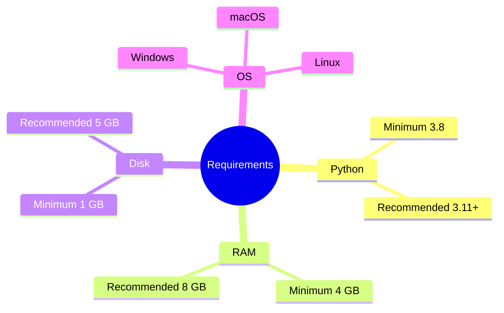

### Installation Steps

#### Windows

```powershell
# Step 1: Download Python
Visit: https://www.python.org/downloads/

# Step 2: Run Installer
# ⚠️ IMPORTANT: Check "Add Python to PATH"

# Step 3: Verify Installation
python --version
# Expected: Python 3.11.x
```

#### macOS

```bash
# Using Homebrew (Recommended)
/bin/bash -c "$(curl -fsSL https://raw.githubusercontent.com/Homebrew/install/HEAD/install.sh)"
brew install python3
python3 --version
```

#### Linux (Ubuntu/Debian)

```bash
sudo apt update
sudo apt install python3 python3-pip
python3 --version
```

### Recommended IDE Setup

<p align="center">
  
  
</p>

**VS Code Extensions:**
- Python (Microsoft)
- Pylance
- Python Indent
- autoDocstring

---

## 4. 🏗️ Project Structure

```
Python-Practical-Works/
│
├── 📄 README.md                    # This comprehensive guide
│
├── 📄 Exercise 1.py               # Bank Account System
│   ├── BankAccount class
│   ├── Private attributes (__balance)
│   └── deposit/withdraw methods
│
├── 📄 Exercise 2.py               # Vector2D Calculator
│   ├── Vector2D class
│   ├── Mathematical operators
│   └── Dunder methods
│
├── 📄 Exercise 3.py               # School Management
│   ├── Person (Base class)
│   ├── Student (Inherited)
│   └── Teacher (Inherited)
│
├── 📄 Exercise 4.py               # Connected Vehicles
│   ├── Vehicle (Root)
│   ├── ElectricVehicle
│   ├── ConnectedVehicle
│   └── ConnectedElectricCar
│
└── 📄 Exercise .py                # Library Management System
    ├── Document (Abstract)
    ├── Book
    ├── ScientificArticle
    └── Library
```

---

## 5. 💡 Working Methodology

### Recommended Learning Path

```mermaid
flowchart TD
    subgraph "6-STEP METHODOLOGY"
    S1[📖 STEP 1: READ] --> S2[👀 STEP 2: ANALYZE]
    S2 --> S3[⌨️ STEP 3: RUN]
    S3 --> S4[🔧 STEP 4: EXPERIMENT]
    S4 --> S5[💻 STEP 5: SOLVE]
    S5 --> S6[📝 STEP 6: REVIEW]
    
    S1 -.- "15 min":::time
    S2 -.- "10 min":::time
    S3 -.- "5 min":::time
    S4 -.- "20 min":::time
    S5 -.- "30 min":::time
    S6 -.- "10 min":::time
    
    classDef time fill:#fff,stroke:#666,stroke-width:1px,font-size:12px
    end
    
    style S1 fill:#e3f2fd
    style S2 fill:#e3f2fd
    style S3 fill:#e8f5e9
    style S4 fill:#fff3e0
    style S5 fill:#fce4ec
    style S6 fill:#f3e5f5
```

### Best Practices

#### ✅ Do's

```python
# ✅ Use meaningful class names
class BankAccount:        # Good: Describes the object
class BA:                # Bad: Too abbreviated

# ✅ Use descriptive variable names
account_balance = 1000   # Good: Clear purpose
x = 1000                 # Bad: Unclear

# ✅ Add docstrings to classes and methods
class Vector2D:
    """Represents a 2D vector with x and y coordinates."""
    
    def add(self, other):
        """Add two vectors together and return new Vector2D."""
        pass

# ✅ Use proper indentation (4 spaces)
class Example:
    def method(self):
        print("Indented properly")
```

#### ❌ Don'ts

```python
# ❌ Avoid: Using single letters except for loops
for i in range(10):      # OK for simple loops
for x in coordinates:    # Better: descriptive

# ❌ Avoid: Hardcoding values
if age > 18:             # OK
MIN_AGE = 18             # Better: Named constant
if age > MIN_AGE:

# ❌ Avoid: Complex one-liners
result = [x**2 for x in range(10) if x % 2 == 0]  # Hard to read
```

### Time Management

```mermaid
gantt
    title Course Time Allocation
    dateFormat X
    axisFormat %s min
    
    Exercise 1 Theory      :a1, 0, 15
    Exercise 1 Practice   :a2, 15, 45
    
    Exercise 2 Theory      :b1, 45, 65
    Exercise 2 Practice   :b2, 65, 105
    
    Exercise 3 Theory      :c1, 105, 130
    Exercise 3 Practice   :c2, 130, 175
    
    Exercise 4 Theory      :d1, 175, 205
    Exercise 4 Practice   :d2, 205, 255
    
    Final Project Theory   :e1, 255, 300
    Final Project Practice :e2, 300, 390
```

---

## 6. 🧠 OOP Fundamentals

### The Four Pillars of OOP

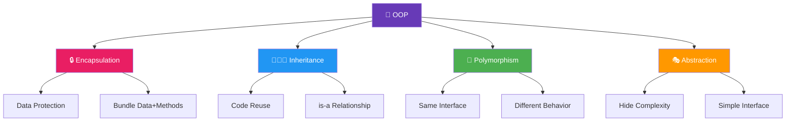

### 6.1 Encapsulation

> **Definition**: Bundling data and methods that work on that data within one unit

```python
class BankAccount:
    """Encapsulates banking operations and data protection."""
    
    def __init__(self, holder: str, initial_balance: float):
        # Public attribute
        self.holder = holder
        
        # Protected attribute (convention)
        self._bank_name = "Default Bank"
        
        # Private attribute (name mangling)
        self.__balance = initial_balance
    
    def deposit(self, amount: float) -> None:
        """Deposit money into account."""
        if amount > 0:
            self.__balance += amount
            print(f"✅ Deposited: ${amount}")
```

### 6.2 Inheritance

> **Definition**: Creating new classes from existing ones

```python
# Base Class (Parent)
class Person:
    def __init__(self, name: str, age: int):
        self.name = name
        self.age = age

# Derived Class (Child)
class Student(Person):
    def __init__(self, name: str, age: int, major: str):
        super().__init__(name, age)  # Call parent's __init__
        self.major = major
```

### 6.3 Polymorphism

> **Definition**: Same interface, different implementations

```python
class Cat:
    def speak(self):
        return "Meow!"

class Dog:
    def speak(self):
        return "Woof!"

for animal in [Cat(), Dog()]:
    print(animal.speak())
```

---

## 7. 📝 Exercises Detail

### Exercise 1: Bank Account System 🏦

**File**: `Exercise 1.py`

#### Learning Objectives

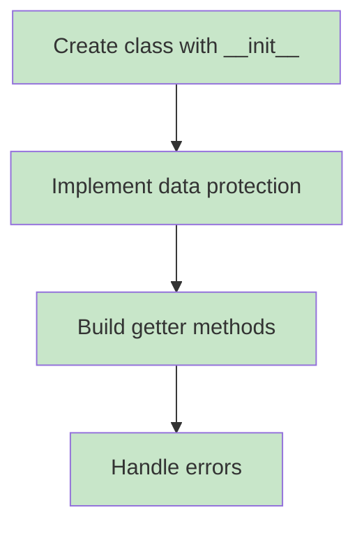

#### Code Analysis

```python
class BankAccount:
    """
    Represents a bank account with basic operations.
    
    Attributes:
        holder (str): Account holder's name
        _bank (str): Bank name (protected)
        __balance (float): Account balance (private)
    """
    
    def __init__(self, holder: str, initial_balance: float):
        self.holder = holder
        self._bank = "Attijariwafa Bank"
        self.__balance = initial_balance
    
    def deposit(self, amount: float) -> None:
        if amount > 0:
            self.__balance += amount
            print(f"✅ Deposited: ${amount}")
    
    def withdraw(self, amount: float) -> bool:
        ifbalance:
            self amount <= self.__.__balance -= amount
            return True
        return False
    
    def get_balance(self) -> float:
        return self.__balance
```

#### UML Diagram

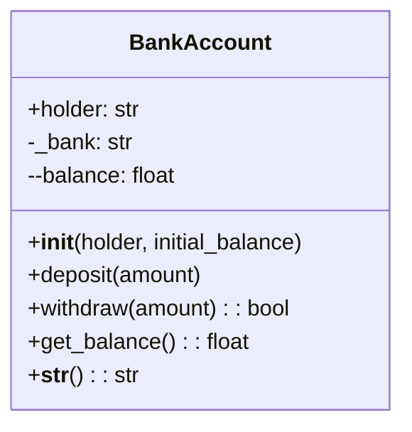

---

### Exercise 2: Vector2D Calculator ➗

**File**: `Exercise 2.py`

#### Learning Objectives

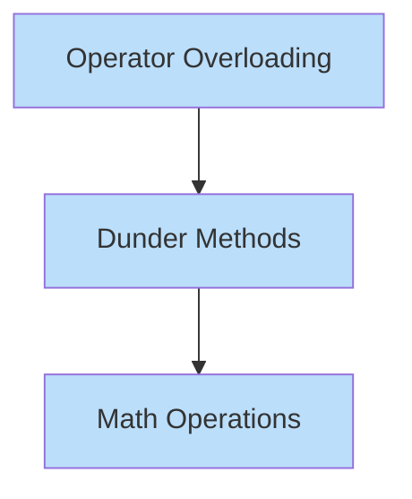

#### Operators Reference

```mermaid
graph LR
    A[Method] --> B[Operator]
    B --> C[Usage]
    C --> D[Result]
    
    M1[__add__] --> O1[+] --> U1[v1 + v2] --> R1[New Vector2D]
    M2[__sub__] --> O2[-] --> U2[v1 - v2] --> R2[New Vector2D]
    M3[__mul__] --> O3[*] --> U3[v1 * 3] --> R3[New Vector2D]
    M4[__eq__] --> O4[==] --> U4[v1 == v2] --> R4[Boolean]
    M5[__len__] --> O5[len()] --> U5[len(v1)] --> R5[Integer]
```

---

### Exercise 3: School Management System 🎓

**File**: `Exercise 3.py`

#### Learning Objectives

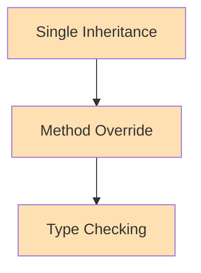

#### Class Hierarchy

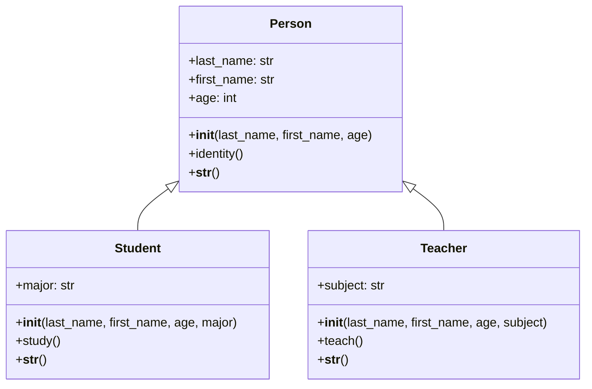

---

### Exercise 4: Connected Vehicles 🚗

**File**: `Exercise 4.py`

#### Learning Objectives

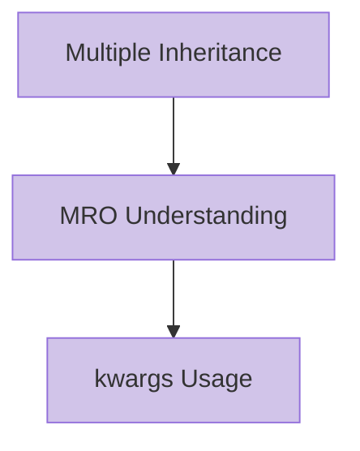

#### Multiple Inheritance Diagram

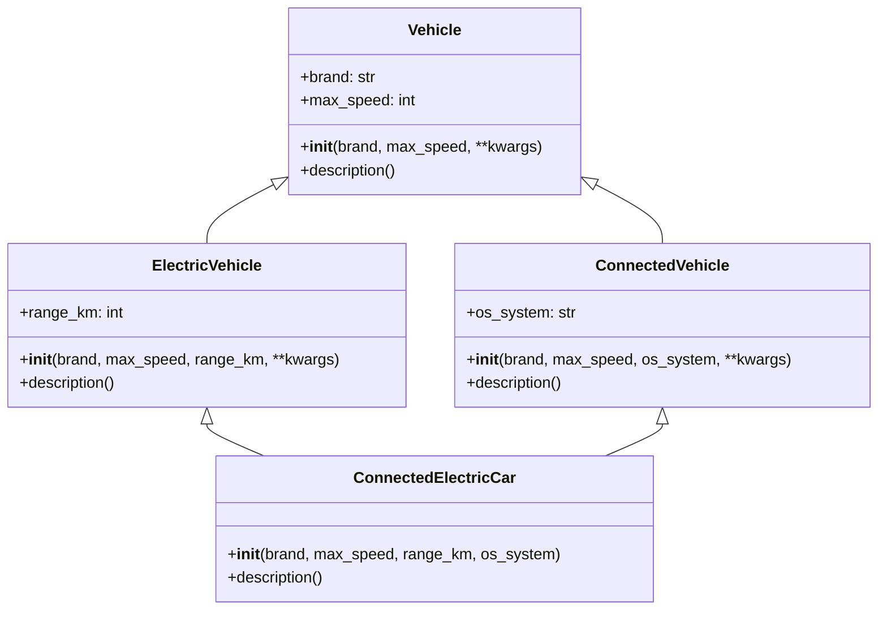

#### MRO Visualization

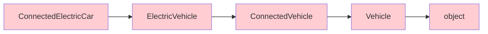

---

### Final Project: Library Management System 📚

**File**: `Exercise .py`

#### Features

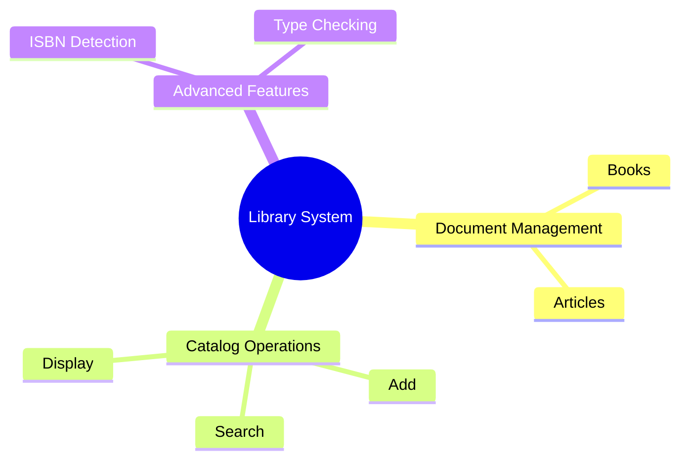

---

## 8. 🚀 Running Exercises

### Quick Start

```bash
# Navigate to project directory
cd Python-Practical-Works

# Run individual exercises
python Exercise1.py
python Exercise2.py
python Exercise3.py
python Exercise4.py
python "Exercise .py"
```

---

## 9. 📤 Expected Outputs

### Exercise 1 Output

```
==================================================
EXERCISE 1 - Bank Account
==================================================
Account created: Account of Yasmine | Balance: 5000 MAD
Deposit of 2000 MAD completed
Withdrawal of 1000 MAD completed
Balance via get_balance(): 6000 MAD
Display via print(): Account of Yasmine | Balance: 6000 MAD
```

### Exercise 2 Output

```
EXERCISE 2 - Vector2D
v1 = (3, 4)
v2 = (1, 2)
v1 + v2 = (4, 6)
v1 * 3 = (9, 12)
Norm of v1 = 5.00
```

### Exercise 3 Output

```
EXERCISE 3 - School System
Last Name: Alaoui, First Name: Yasmine, Age: 20 years
Yasmine studies in Computer Science
Student: Yasmine Alaoui, 20 years old, Major: Computer Science
```

### Exercise 4 Output

```
EXERCISE 4 - Connected Vehicles
Vehicle Tesla, max speed: 250 km/h | Connected, OS: Tesla OS | 
Electric, range: 500 km | Electric & Connected
```

---

## 10. 🔑 Key Concepts Reference

### Python Naming Conventions

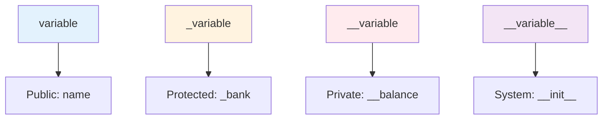

### Important Dunder Methods

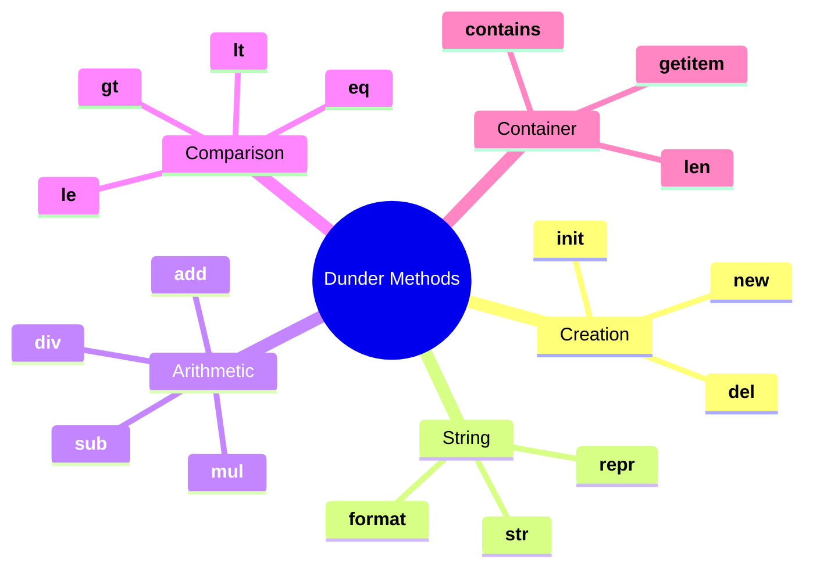

---

## 11. 🎥 Video Resources

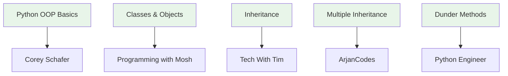

| Topic | Link | Duration |
|-------|------|----------|
| Python OOP Basics | [Corey Schafer](https://www.youtube.com/watch?v=apACNr7DC_s) | 45 min |
| Classes & Objects | [Programming with Mosh](https://www.youtube.com/watch?v=8ok8hJ7D2sE) | 20 min |
| Inheritance | [Tech With Tim](https://www.youtube.com/watch?v=RSl87lqOXDE) | 25 min |
| Multiple Inheritance | [ArjanCodes](https://www.youtube.com/watch?v=0sD3M7EuzE4) | 30 min |
| Dunder Methods | [Python Engineer](https://www.youtube.com/watch?v=z5W3Kqt3y6E) | 35 min |

---

## 12. ❓ FAQ

```mermaid
flowchart TD
    Q1{Q: Difference between _ and __?} --> A1[__: triggers name mangling]
    Q2{Q: When to use inheritance?} --> A2[Use for "is-a" relationships]
    Q3{Q: What is MRO?} --> A3[Method lookup order in multiple inheritance]
    Q4{Q: Can I overload operators?} --> A4[Yes, using dunder methods]
    
    style Q1 fill:#fff9c4
    style Q2 fill:#fff9c4
    style Q3 fill:#fff9c4
    style Q4 fill:#fff9c4
```

---

## 13. 📚 Additional Resources

### Recommended Books

```mermaid
graph TD
    B1[Fluent Python] --> A1[Luciano Ramalho]
    B2[Python Crash Course] --> A2[Eric Matthes]
    B3[Clean Code] --> A3[Robert Martin]
    
    style B1 fill:#e1f5fe
    style B2 fill:#e1f5fe
    style B3 fill:#e1f5fe
```

| Book | Author |
|------|--------|
| Fluent Python | Luciano Ramalho |
| Python Crash Course | Eric Matthes |
| Clean Code | Robert Martin |

---

<p align="center">
  
  
  
</p>

---

<p align="center">
  <strong>Happy Coding! 🚀</strong><br>
  <em>Version 2.0 | Last Updated: 2026</em>
</p>
