# 🐍 Python Object-Oriented Programming: Complete Mastery Course

<p align="center">
  <a href="https://www.python.org/">
    
  </a>
  <a href="#">
    
  </a>
  <a href="#">
    
  </a>
  <a href="#">
    
  </a>
  <a href="#">
    
  </a>
  <a href="#">
    
  </a>
</p>

---

<p align="center">
  
</p>

---

## 📋 Table of Contents

| Section | Description | Icon |
|---------|-------------|------|
| [1. Overview](#1-overview) | Course introduction | 🏠 |
| [2. Objectives](#2-objectives) | Learning goals | 🎯 |
| [3. Prerequisites](#3-prerequisites) | Environment setup | 💻 |
| [4. Structure](#4-structure) | Project files | 📂 |
| [5. Methodology](#5-methodology) | Learning approach | 📖 |
| [6. OOP Theory](#6-oop-theory) | Core concepts | 🧠 |
| [7. Exercises](#7-exercises) | Practice problems | 📝 |
| [8. Running Code](#8-running-code) | Execution guide | ▶️ |
| [9. Outputs](#9-outputs) | Expected results | 📊 |
| [10. Reference](#10-reference) | Quick reference | 💡 |
| [11. Videos](#11-videos) | Learning videos | 🎬 |
| [12. FAQ](#12-faq) | Help section | ❓ |
| [13. Resources](#13-resources) | Further reading | 📚 |

---

## 1. Overview

### Course Introduction

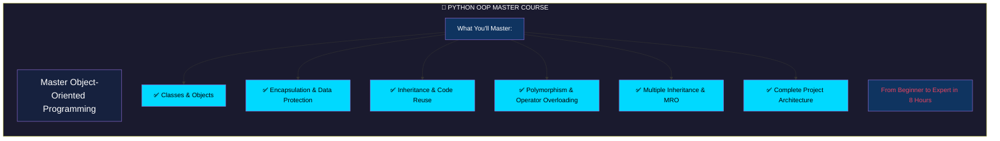

### Course Roadmap

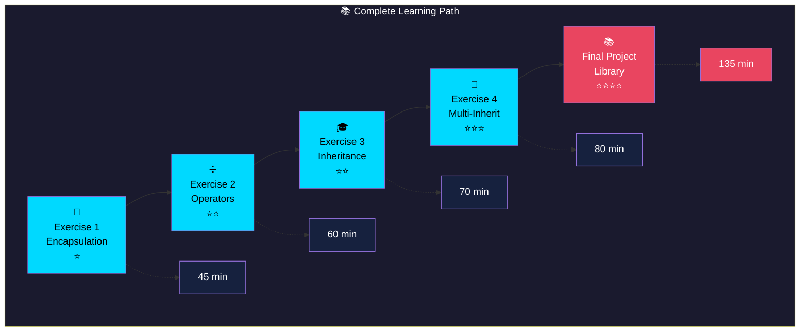

---

## 2. Objectives

### Learning Goals

```mermaid
mindmap
  root((🎯 LEARNING OBJECTIVES))
    Core Skills
      Class Design
        Object creation
        Constructor patterns
        Instantiation
      Encapsulation
        Data protection
        Private attributes
        Public interface
    Advanced Skills
      Inheritance
        Single inheritance
        Multiple inheritance
        super() function
      Polymorphism
        Operator overloading
        Dunder methods
        Method overriding
    Project Skills
      Architecture
        System design
        Code organization
        Best practices
```

### Skills Matrix

| Skill Level | Topic | Exercise | Duration |
|-------------|-------|----------|----------|
| ⭐ Beginner | Encapsulation | Exercise 1 | 45 min |
| ⭐⭐ Intermediate | Operator Overloading | Exercise 2 | 60 min |
| ⭐⭐ Intermediate | Single Inheritance | Exercise 3 | 70 min |
| ⭐⭐⭐ Advanced | Multiple Inheritance | Exercise 4 | 80 min |
| ⭐⭐⭐⭐ Expert | Full Project | Final | 135 min |

---

## 3. Prerequisites

### System Requirements

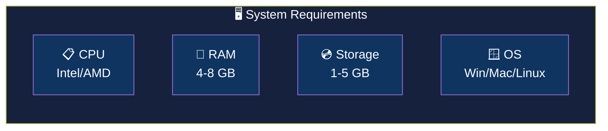

| Component | Minimum | Recommended | Status |
|-----------|---------|-------------|--------|
| **Python** | 3.8+ | 3.12+ | ✅ Required |
| **RAM** | 4 GB | 8 GB | ✅ Required |
| **Disk** | 1 GB | 5 GB | ✅ Required |
| **OS** | Win/Mac/Linux | Win 11/Mac/Ubuntu | ✅ Required |

### Installation Guide

#### Windows

```bash
# Download Python from official website
# https://www.python.org/downloads/
# IMPORTANT: Check "Add Python to PATH"

# Verify installation
python --version
```

#### macOS

```bash
# Using Homebrew
brew install python3

# Verify
python3 --version
```

#### Linux

```bash
# Ubuntu/Debian
sudo apt update && sudo apt install python3 python3-pip

# Verify
python3 --version
```

---

## 4. Structure

### Project Architecture

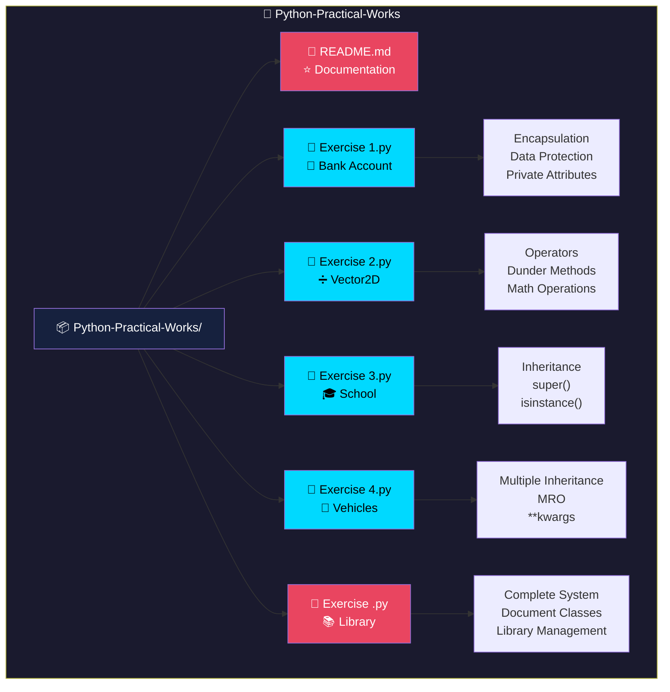

---

## 5. Methodology

### Learning Strategy

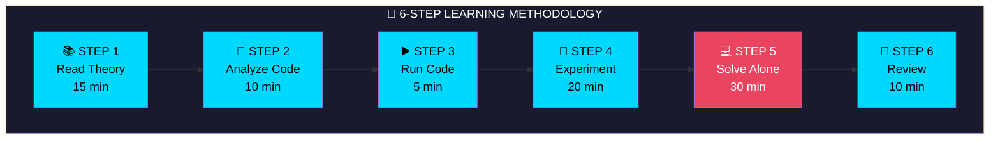

### Time Management

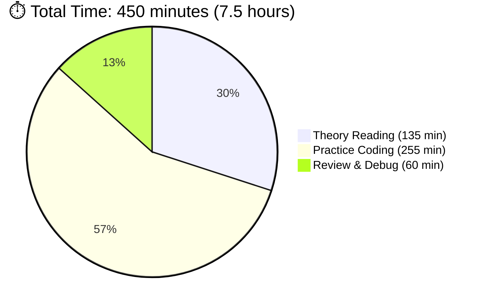

---

## 6. OOP Theory

### The Four Pillars

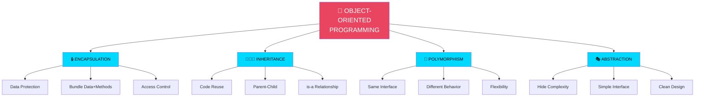

---

## 7. Exercises

### Exercise 1: Bank Account System 🏦

**Difficulty**: ⭐ Beginner | **Focus**: Encapsulation

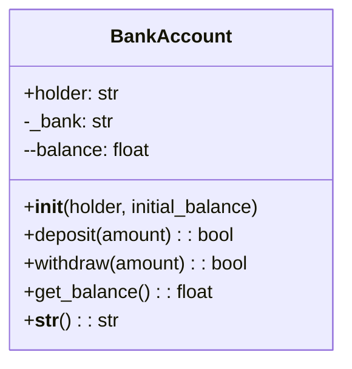

**Key Concepts**:
- `__init__()` - Constructor
- `self` - Instance reference
- `__balance` - Private attribute
- `get_balance()` - Getter method

---

### Exercise 2: Vector2D Calculator ➗

**Difficulty**: ⭐⭐ Intermediate | **Focus**: Operator Overloading

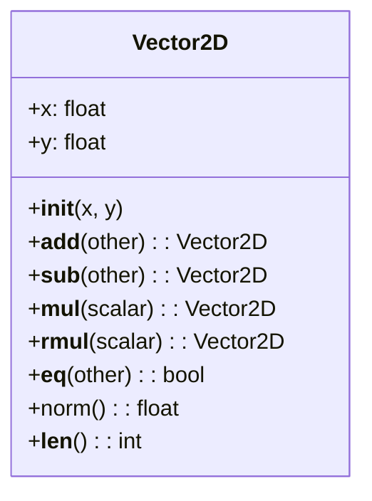

**Operators Table**

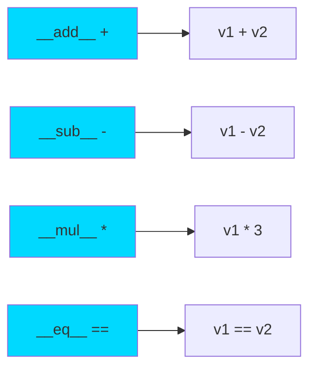

---

### Exercise 3: School Management 🎓

**Difficulty**: ⭐⭐ Intermediate | **Focus**: Single Inheritance

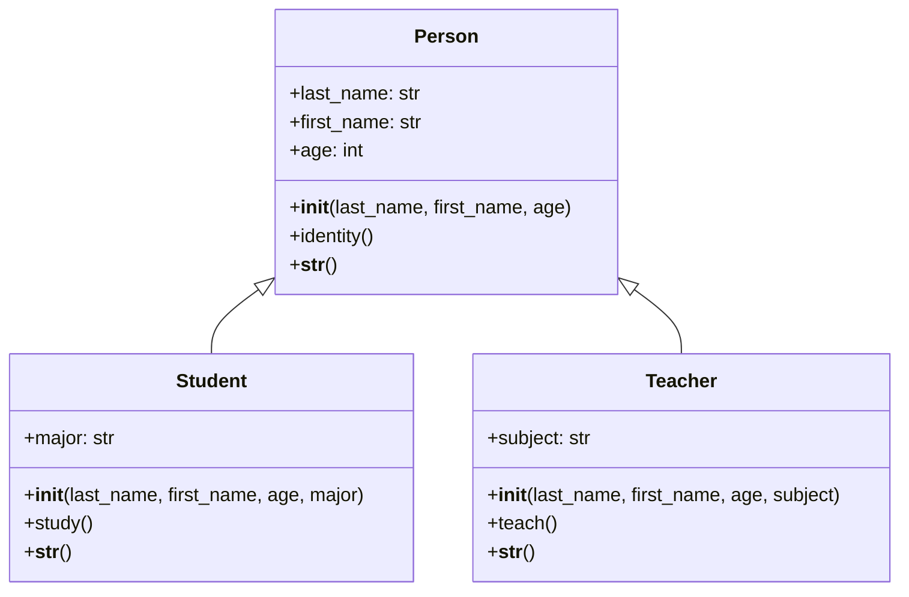

---

### Exercise 4: Connected Vehicles 🚗

**Difficulty**: ⭐⭐⭐ Advanced | **Focus**: Multiple Inheritance

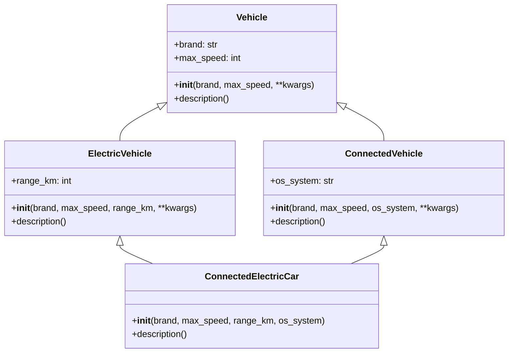

### MRO Chain


---

### Final Project: Library System 📚

**Difficulty**: ⭐⭐⭐⭐ Expert | **Focus**: Complete Project

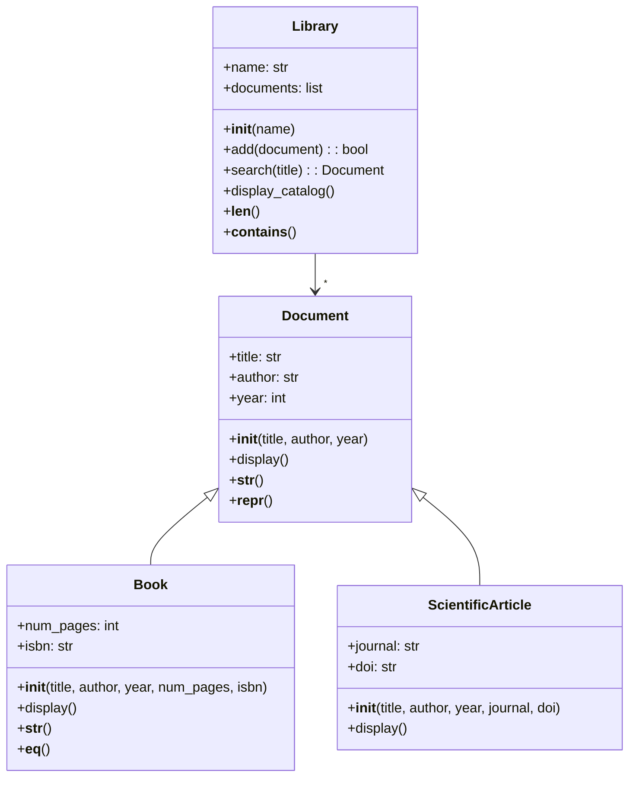

---

## 8. Running Code

### Execution Guide

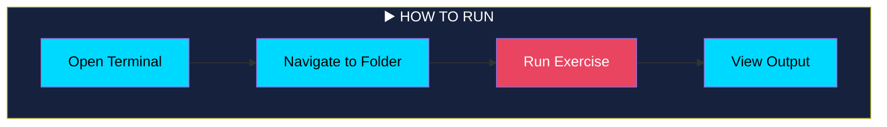

```bash
# Navigate to project
cd Python-Practical-Works

# Run individual exercises
python Exercise1.py
python Exercise2.py
python Exercise3.py
python Exercise4.py
python "Exercise .py"

# Run all exercises
python Exercise1.py && python Exercise2.py && python Exercise3.py && python Exercise4.py
```

---

## 9. Outputs

### Expected Results

#### Exercise 1 Output

```mermaid
flowchart TB
    subgraph Out1[💰 Exercise 1: Bank Account]
        O1[Account created: Account of Yasmine | Balance: 5000 MAD]:::out
        O2[Deposit of 2000 MAD completed]:::out
        O3[Withdrawal of 1000 MAD completed]:::out
        O4[Balance via get_balance(): 6000 MAD]:::out
    end
    
    style Out1 fill:#1b5e20,color:#fff
    style O1 fill:#4caf50,color:#fff
    style O2 fill:#4caf50,color:#fff
    style O3 fill:#4caf50,color:#fff
    style O4 fill:#4caf50,color:#fff
```

#### Exercise 2 Output

```mermaid
flowchart TB
    subgraph Out2[➗ Exercise 2: Vector2D]
        V1[v1 = (3, 4)]:::out
        V2[v2 = (1, 2)]:::out
        V3[v1 + v2 = (4, 6)]:::out
        V4[v1 * 3 = (9, 12)]:::out
        V5[Norm of v1 = 5.00]:::out
    end
    
    style Out2 fill:#0d47a1,color:#fff
    style V1 fill:#42a5f5,color:#000
    style V2 fill:#42a5f5,color:#000
    style V3 fill:#42a5f5,color:#000
    style V4 fill:#42a5f5,color:#000
    style V5 fill:#42a5f5,color:#000
```

---

## 10. Reference

### Quick Reference Guide

```mermaid
mindmap
  root((💡 KEY REFERENCE))
    Python Naming
      public name
      protected _name
      private __name
    Dunder Methods
      __init__ constructor
      __str__ string
      __add__ add
      __sub__ subtract
      __eq__ equality
    Inheritance
      super() parent call
      isinstance() type check
      __mro__ method order
```

---

## 11. Videos

### Recommended Tutorials

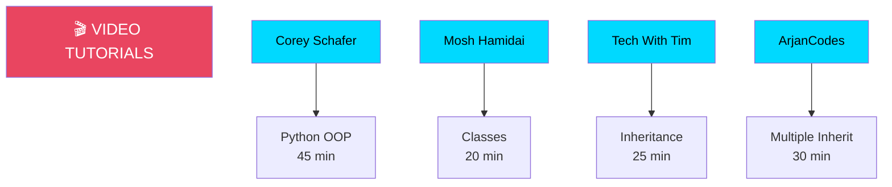

| Topic | Video | Duration | Link |
|-------|-------|----------|------|
| OOP Basics | Corey Schafer | 45 min | [Watch](https://www.youtube.com/watch?v=apACNr7DC_s) |
| Classes | Mosh Hamidai | 20 min | [Watch](https://www.youtube.com/watch?v=8ok8hJ7D2sE) |
| Inheritance | Tech With Tim | 25 min | [Watch](https://www.youtube.com/watch?v=RSl87lqOXDE) |
| MRO | ArjanCodes | 30 min | [Watch](https://www.youtube.com/watch?v=0sD3M7EuzE4) |

---

## 12. FAQ

### Frequently Asked Questions

```mermaid
flowchart TD
    FAQ[❓ FREQUENTLY ASKED QUESTIONS]:::faqHeader
    
    Q1{"What's difference<br/>between _ and __?"}:::question
    Q2{"When should I<br/>use inheritance?"}:::question
    Q3{"What is MRO<br/>in Python?"}:::question
    Q4{"Can I overload<br/>operators in Python?"}:::question
    
    Q1 --> A1["__ triggers name mangling<br/>for data protection"]:::answer
    Q2 --> A2["Use when there's an<br/>'is-a' relationship"]:::answer
    Q3 --> A3["Method Resolution Order:<br/>lookup sequence in inheritance"]:::answer
    Q4 --> A4["Yes! Use dunder methods<br/>like __add__, __mul__"]:::answer
    
    style FAQ fill:#16213e,color:#fff,font-size:20px
    style Q1 fill:#00d9ff,color:#000
    style Q2 fill:#00d9ff,color:#000
    style Q3 fill:#00d9ff,color:#000
    style Q4 fill:#00d9ff,color:#000
    style A1 fill:#e94560,color:#fff
    style A2 fill:#e94560,color:#fff
    style A3 fill:#e94560,color:#fff
    style A4 fill:#e94560,color:#fff
```

---

## 13. Resources

### Additional Learning Materials

```mermaid
mindmap
  root((📚 ADDITIONAL RESOURCES))
    Books
      Fluent Python
      Python Crash Course
      Clean Code
    Websites
      Real Python
      Python Docs
      W3Schools
    Practice
      LeetCode
      HackerRank
      Codewars
```

### Recommended Books

| Book | Author | Level |
|------|--------|-------|
| Fluent Python | Luciano Ramalho | Advanced |
| Python Crash Course | Eric Matthes | Beginner |
| Clean Code | Robert Martin | All Levels |

---

<p align="center">
  
  ━━━━━━━━━━━━━━━━━━━━━━━━━━━━━━━━━━━━━━━━━━━━━━━━━━━━━━━━━━━━━━━━━━━━━━━
  
  🎉 **THANK YOU FOR USING THIS COURSE!** 🎉
  
  ━━━━━━━━━━━━━━━━━━━━━━━━━━━━━━━━━━━━━━━━━━━━━━━━━━━━━━━━━━━━━━━━━━━━━━━
  
  
  
</p>

---

<p align="center">
  <strong>🚀 Happy Coding! Build Something Amazing! 🚀</strong><br>
  <em>⭐ Please star this repository if you found it helpful!</em>
</p>

---
