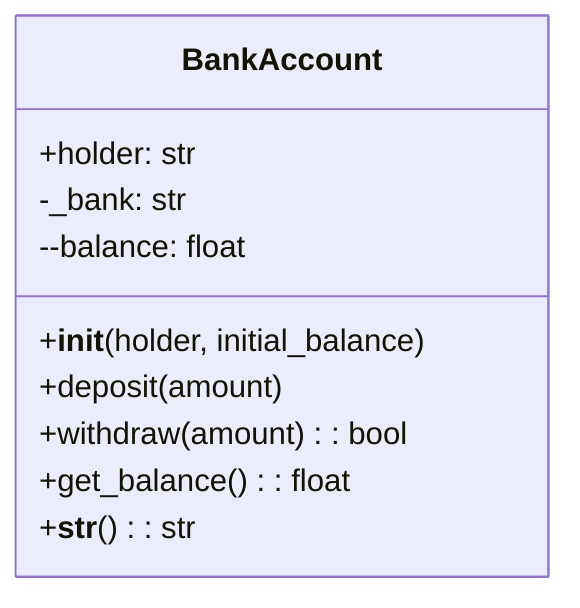
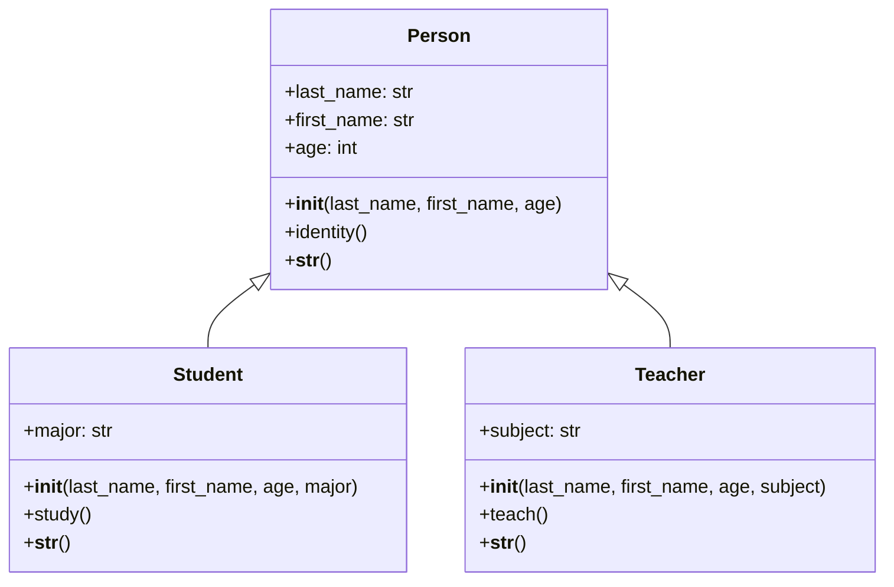
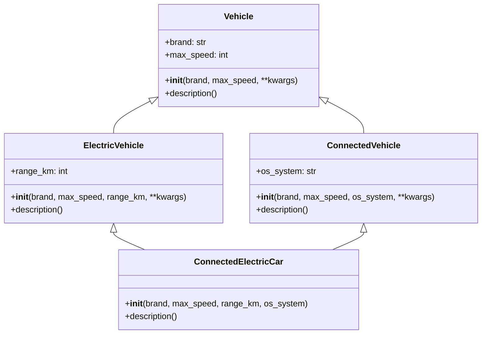

# 🐍 Python Object-Oriented Programming: Complete Mastery Course

<p align="center">
  <a href="https://www.python.org/">
    
  </a>
  <a href="#">
    
  </a>
  <a href="#">
    
  </a>
  <a href="#">
    
  </a>
  <a href="#">
    
  </a>
</p>

---

<p align="center">
  
</p>

---

## 📋 Table of Contents

1. [📖 Introduction](#1-简介)
2. [🎯 Objectives](#2-学习目标)
3. [📦 Prerequisites](#3-环境配置)
4. [🏗️ Project Structure](#4-项目结构)
5. [💡 Working Methodology](#5-工作方法论)
6. [🧠 OOP Fundamentals](#6-面向对象基础)
7. [📝 Exercises Detail](#7-练习详解)
8. [🚀 Running Exercises](#8-运行练习)
9. [📤 Expected Outputs](#9-预期输出)
10. [🔑 Key Concepts](#10-关键概念)
11. [🎥 Video Resources](#11-视频资源)
12. [❓ FAQ](#12-常见问题)
13. [📚 Additional Resources](#13-附加资源)

---

## 1. 📖 Introduction

### Course Overview

This comprehensive course provides a **complete mastery of Object-Oriented Programming (OOP)** using Python. Through hands-on exercises, you will learn fundamental and advanced OOP concepts that are essential for building robust, scalable, and maintainable applications.

> **Target Audience**: Developers looking to strengthen their Python OOP skills
> 
> **Prerequisites**: Basic Python knowledge
> 
> **Learning Format**: Self-paced with hands-on exercises

---

## 2. 🎯 Objectives

### Learning Outcomes

```
┌─────────────────────────────────────────────────────────────────────────────┐
│                           COURSE OBJECTIVES                                 │
├─────────────────────────────────────────────────────────────────────────────┤
│                                                                             │
│  ✅ Master class design and object creation                                │
│  ✅ Understand encapsulation and data protection                            │
│  ✅ Implement inheritance and code reuse                                    │
│  ✅ Apply polymorphism through operator overloading                         │
│  ✅ Handle complex inheritance hierarchies                                  │
│  ✅ Build complete OOP-based projects                                      │
│                                                                             │
└─────────────────────────────────────────────────────────────────────────────┘
```

### Skills You Will Gain

| Skill | Description | Exercise |
|-------|-------------|----------|
| **Encapsulation** | Data protection and access control | Exercise 1 |
| **Operator Overloading** | Custom behavior for operators | Exercise 2 |
| **Single Inheritance** | Parent-child class relationships | Exercise 3 |
| **Multiple Inheritance** | Complex class hierarchies | Exercise 4 |
| **Project Architecture** | Full system design | Final Project |

---

## 3. 📦 Prerequisites

### System Requirements

| Requirement | Minimum | Recommended |
|-------------|---------|-------------|
| **Python** | 3.8 | 3.11+ |
| **RAM** | 4 GB | 8 GB |
| **Disk** | 1 GB | 5 GB |
| **OS** | Windows/Mac/Linux | Windows 11 / macOS / Ubuntu 22.04 |

### Installation Steps

#### Windows

```powershell
# Step 1: Download Python
Visit: https://www.python.org/downloads/

# Step 2: Run Installer
# ⚠️ IMPORTANT: Check "Add Python to PATH"

# Step 3: Verify Installation
python --version
# Expected: Python 3.11.x
```

#### macOS

```bash
# Using Homebrew (Recommended)
/bin/bash -c "$(curl -fsSL https://raw.githubusercontent.com/Homebrew/install/HEAD/install.sh)"
brew install python3
python3 --version
```

#### Linux (Ubuntu/Debian)

```bash
sudo apt update
sudo apt install python3 python3-pip
python3 --version
```

### Recommended IDE Setup

<p align="center">
  
  
</p>

**VS Code Extensions:**
- Python (Microsoft)
- Pylance
- Python Indent
- autoDocstring

---

## 4. 🏗️ Project Structure

```
Python-Practical-Works/
│
├── 📄 README.md                    # This comprehensive guide
│
├── 📄 Exercise 1.py               # Bank Account System
│   ├── BankAccount class
│   ├── Private attributes (__balance)
│   └── deposit/withdraw methods
│
├── 📄 Exercise 2.py               # Vector2D Calculator
│   ├── Vector2D class
│   ├── Mathematical operators
│   └── Dunder methods
│
├── 📄 Exercise 3.py               # School Management
│   ├── Person (Base class)
│   ├── Student (Inherited)
│   └── Teacher (Inherited)
│
├── 📄 Exercise 4.py               # Connected Vehicles
│   ├── Vehicle (Root)
│   ├── ElectricVehicle
│   ├── ConnectedVehicle
│   └── ConnectedElectricCar
│
└── 📄 Exercise .py                # Library Management System
    ├── Document (Abstract)
    ├── Book
    ├── ScientificArticle
    └── Library
```

---

## 5. 💡 Working Methodology

### Recommended Learning Path

```
┌─────────────────────────────────────────────────────────────────────────────┐
│                        6-STEP LEARNING METHODOLOGY                          │
├─────────────────────────────────────────────────────────────────────────────┤
│                                                                             │
│  ┌─────────────┐                                                            │
│  │   STEP 1   │  📖 READ THE CONCEPT                                       │
│  │  (15 min)  │  Understand theory before coding                           │
│  └──────┬──────┘                                                            │
│         │                                                                    │
│         ▼                                                                    │
│  ┌─────────────┐                                                            │
│  │   STEP 2   │  👀 ANALYZE THE CODE                                       │
│  │  (10 min)  │  Study provided examples                                   │
│  └──────┬──────┘                                                            │
│         │                                                                    │
│         ▼                                                                    │
│  ┌─────────────┐                                                            │
│  │   STEP 3   │  ⌨️  RUN THE EXERCISE                                      │
│  │  (5 min)   │  Execute and observe output                               │
│  └──────┬──────┘                                                            │
│         │                                                                    │
│         ▼                                                                    │
│  ┌─────────────┐                                                            │
│  │   STEP 4   │  🔧 EXPERIMENT                                              │
│  │  (20 min)  │  Modify and test variations                                │
│  └──────┬──────┘                                                            │
│         │                                                                    │
│         ▼                                                                    │
│  ┌─────────────┐                                                            │
│  │   STEP 5   │  💻 SOLVE INDEPENDENTLY                                    │
│  │  (30 min)  │  Try without looking at solution                           │
│  └──────┬──────┘                                                            │
│         │                                                                    │
│         ▼                                                                    │
│  ┌─────────────┐                                                            │
│  │   STEP 6   │  📝 REVIEW AND REFLECT                                     │
│  │  (10 min)  │  Compare with solution, note differences                   │
│  └─────────────┘                                                            │
│                                                                             │
└─────────────────────────────────────────────────────────────────────────────┘
```

### Best Practices

#### ✅ Do's

```python
# ✅ Use meaningful class names
class BankAccount:        # Good: Describes the object
class BA:                # Bad: Too abbreviated

# ✅ Use descriptive variable names
account_balance = 1000   # Good: Clear purpose
x = 1000                 # Bad: Unclear

# ✅ Add docstrings to classes and methods
class Vector2D:
    """Represents a 2D vector with x and y coordinates."""
    
    def add(self, other):
        """Add two vectors together and return new Vector2D."""
        pass

# ✅ Use proper indentation (4 spaces)
class Example:
    def method(self):
        print("Indented properly")
```

#### ❌ Don'ts

```python
# ❌ Avoid: Using single letters except for loops
for i in range(10):      # OK for simple loops
for x in coordinates:    # Better: descriptive

# ❌ Avoid: Hardcoding values
if age > 18:             # OK
MIN_AGE = 18             # Better: Named constant
if age > MIN_AGE:

# ❌ Avoid: Complex one-liners
result = [x**2 for x in range(10) if x % 2 == 0]  # Hard to read

# Better: Break into multiple lines
squares = []
for x in range(10):
    if x % 2 == 0:
        squares.append(x**2)
```

### Time Management

| Exercise | Theory | Practice | Total |
|----------|--------|----------|-------|
| Exercise 1 | 15 min | 30 min | 45 min |
| Exercise 2 | 20 min | 40 min | 60 min |
| Exercise 3 | 25 min | 45 min | 70 min |
| Exercise 4 | 30 min | 50 min | 80 min |
| Final Project | 45 min | 90 min | 135 min |
| **Total** | **135 min** | **255 min** | **6.5 hours** |

---

## 6. 🧠 OOP Fundamentals

### The Four Pillars of OOP

<p align="center">
  
</p>

### 6.1 Encapsulation

> **Definition**: Bundling data and methods that work on that data within one unit

```python
class BankAccount:
    """Encapsulates banking operations and data protection."""
    
    def __init__(self, holder: str, initial_balance: float):
        # Public attribute
        self.holder = holder
        
        # Protected attribute (convention)
        self._bank_name = "Default Bank"
        
        # Private attribute (name mangling)
        self.__balance = initial_balance
    
    def deposit(self, amount: float) -> None:
        """Deposit money into account."""
        if amount > 0:
            self.__balance += amount
            print(f"✅ Deposited: ${amount}")
    
    def withdraw(self, amount: float) -> bool:
        """Withdraw money if sufficient funds exist."""
        if amount <= self.__balance:
            self.__balance -= amount
            print(f"✅ Withdrawn: ${amount}")
            return True
        print(f"❌ Insufficient funds")
        return False
    
    def get_balance(self) -> float:
        """Getter method to access private data."""
        return self.__balance
```

### 6.2 Inheritance

> **Definition**: Creating new classes from existing ones

```python
# Base Class (Parent)
class Person:
    def __init__(self, name: str, age: int):
        self.name = name
        self.age = age
    
    def introduce(self) -> str:
        return f"I am {self.name}"

# Derived Class (Child)
class Student(Person):
    def __init__(self, name: str, age: int, major: str):
        super().__init__(name, age)  # Call parent's __init__
        self.major = major
    
    def study(self) -> str:
        return f"{self.name} studies {self.major}"
```

### 6.3 Polymorphism

> **Definition**: Same interface, different implementations

```python
class Cat:
    def speak(self):
        return "Meow!"

class Dog:
    def speak(self):
        return "Woof!"

# Same method, different behavior
for animal in [Cat(), Dog()]:
    print(animal.speak())  # Different outputs!
```

### 6.4 Abstraction

> **Definition**: Hiding complex implementation details

```python
from abc import ABC, abstractmethod

class Shape(ABC):
    @abstractmethod
    def area(self):
        """Subclasses must implement this."""
        pass

class Circle(Shape):
    def __init__(self, radius):
        self.radius = radius
    
    def area(self):
        return 3.14 * self.radius ** 2
```

---

## 7. 📝 Exercises Detail

### Exercise 1: Bank Account System 🏦

**File**: `Exercise 1.py`

#### Learning Objectives

| Objective | Description |
|-----------|-------------|
| Create a class with constructor | Use `__init__` to initialize objects |
| Implement data protection | Apply encapsulation with private attributes |
| Build getter methods | Return private data safely |
| Handle errors | Validate input in methods |

#### Code Analysis

```python
class BankAccount:
    """
    Represents a bank account with basic operations.
    
    Attributes:
        holder (str): Account holder's name
        _bank (str): Bank name (protected)
        __balance (float): Account balance (private)
    """
    
    def __init__(self, holder: str, initial_balance: float):
        """Initialize account with holder name and starting balance."""
        self.holder = holder
        self._bank = "Attijariwafa Bank"
        self.__balance = initial_balance
    
    def deposit(self, amount: float) -> None:
        """
        Deposit money into the account.
        
        Args:
            amount: Positive amount to deposit
            
        Returns:
            None
        """
        if amount > 0:
            self.__balance += amount
            print(f"✅ Deposit successful: ${amount}")
        else:
            print("❌ Invalid amount")
    
    def withdraw(self, amount: float) -> bool:
        """Withdraw money if sufficient balance exists."""
        if amount <= 0:
            print("❌ Amount must be positive")
            return False
        elif amount <= self.__balance:
            self.__balance -= amount
            print(f"✅ Withdrawal successful: ${amount}")
            return True
        else:
            print(f"❌ Insufficient funds")
            return False
    
    def get_balance(self) -> float:
        """Return current balance."""
        return self.__balance
    
    def __str__(self) -> str:
        """String representation of account."""
        return f"Account: {self.holder} | Balance: ${self.__balance}"
```

#### UML Diagram



---

### Exercise 2: Vector2D Calculator ➗

**File**: `Exercise 2.py`

#### Learning Objectives

| Objective | Description |
|-----------|-------------|
| Operator overloading | Customize operator behavior |
| Dunder methods | Implement special Python methods |
| Mathematical operations | Vector arithmetic |

#### Code Analysis

```python
import math

class Vector2D:
    """Represents a 2-dimensional vector."""
    
    def __init__(self, x: float = 0, y: float = 0):
        self.x = x
        self.y = y
    
    # String representations
    def __str__(self):
        """Human-readable string."""
        return f"({self.x}, {self.y})"
    
    def __repr__(self):
        """Developer representation."""
        return f"Vector2D({self.x}, {self.y})"
    
    # Arithmetic operators
    def __add__(self, other: 'Vector2D') -> 'Vector2D':
        """Vector addition: v1 + v2"""
        return Vector2D(self.x + other.x, self.y + other.y)
    
    def __sub__(self, other: 'Vector2D') -> 'Vector2D':
        """Vector subtraction: v1 - v2"""
        return Vector2D(self.x - other.x, self.y - other.y)
    
    def __mul__(self, scalar: float) -> 'Vector2D':
        """Scalar multiplication: v * 3"""
        return Vector2D(self.x * scalar, self.y * scalar)
    
    def __rmul__(self, scalar: float) -> 'Vector2D':
        """Right multiplication: 3 * v"""
        return self.__mul__(scalar)
    
    def __eq__(self, other: 'Vector2D') -> bool:
        """Equality check: v1 == v2"""
        return self.x == other.x and self.y == other.y
    
    def norm(self) -> float:
        """Calculate vector magnitude."""
        return math.sqrt(self.x**2 + self.y**2)
    
    def __len__(self) -> int:
        """Return norm as integer."""
        return round(self.norm())
```

#### Operators Reference

| Method | Operator | Usage | Result |
|--------|----------|-------|--------|
| `__add__` | `+` | `v1 + v2` | New Vector2D |
| `__sub__` | `-` | `v1 - v2` | New Vector2D |
| `__mul__` | `*` | `v1 * 3` | New Vector2D |
| `__rmul__` | `*` | `3 * v1` | New Vector2D |
| `__eq__` | `==` | `v1 == v2` | Boolean |
| `__len__` | `len()` | `len(v1)` | Integer |

---

### Exercise 3: School Management System 🎓

**File**: `Exercise 3.py`

#### Learning Objectives

| Objective | Description |
|-----------|-------------|
| Single inheritance | Parent-child class relationships |
| Method overriding | Customize inherited behavior |
| Type checking | Use `isinstance()` |

#### Class Hierarchy



---

### Exercise 4: Connected Vehicles 🚗

**File**: `Exercise 4.py`

#### Learning Objectives

| Objective | Description |
|-----------|-------------|
| Multiple inheritance | Inherit from multiple parents |
| MRO (Method Resolution Order) | Understand method lookup |
| **kwargs | Flexible parameter passing |

#### Multiple Inheritance Diagram



#### MRO Visualization

```python
# Method Resolution Order
ConnectedElectricCar.__mro__

# Output:
# (ConnectedElectricCar,
#  ElectricVehicle,
#  ConnectedVehicle,
#  Vehicle,
#  object)
```

---

### Final Project: Library Management System 📚

**File**: `Exercise .py`

#### Features

- Document management (Books, Articles)
- Library catalog operations
- Search functionality
- ISBN-based duplicate detection

---

## 8. 🚀 Running Exercises

### Quick Start

```bash
# Navigate to project directory
cd Python-Practical-Works

# Run individual exercises
python Exercise1.py
python Exercise2.py
python Exercise3.py
python Exercise4.py
python "Exercise .py"

# Run all exercises
python Exercise1.py && python Exercise2.py && python Exercise3.py && python Exercise4.py && python "Exercise .py"
```

### VS Code Setup

1. **Open Project**: `File > Open Folder > Python-Practical-Works`
2. **Run File**: Right-click > `Run Python File in Terminal`
3. **Debug**: F5 for debugging mode

---

## 9. 📤 Expected Outputs

### Exercise 1 Output
```
==================================================
EXERCISE 1 - Bank Account
==================================================
Account created: Account of Yasmine | Balance: 5000 MAD
Deposit of 2000 MAD completed
Withdrawal of 1000 MAD completed
Balance via get_balance(): 6000 MAD
Display via print(): Account of Yasmine | Balance: 6000 MAD
```

### Exercise 2 Output
```
EXERCISE 2 - Vector2D
v1 = (3, 4)
v2 = (1, 2)
v1 + v2 = (4, 6)
v1 * 3 = (9, 12)
Norm of v1 = 5.00
```

### Exercise 3 Output
```
EXERCISE 3 - School System
Last Name: Alaoui, First Name: Yasmine, Age: 20 years
Yasmine studies in Computer Science
Student: Yasmine Alaoui, 20 years old, Major: Computer Science
```

### Exercise 4 Output
```
EXERCISE 4 - Connected Vehicles
Vehicle Tesla, max speed: 250 km/h | Connected, OS: Tesla OS | 
Electric, range: 500 km | Electric & Connected
```

---

## 10. 🔑 Key Concepts Reference

### Python Naming Conventions

| Convention | Example | Use Case |
|------------|---------|----------|
| `variable` | `name` | Public attribute |
| `_variable` | `_bank` | Protected (internal) |
| `__variable` | `__balance` | Private (name mangled) |
| `__variable__` | `__init__` | System-defined |

### Important Dunder Methods

| Category | Methods |
|----------|---------|
| **Creation** | `__init__`, `__new__`, `__del__` |
| **String** | `__str__`, `__repr__`, `__format__` |
| **Arithmetic** | `__add__`, `__sub__`, `__mul__`, `__div__` |
| **Comparison** | `__eq__`, `__lt__`, `__gt__`, `__le__` |
| **Container** | `__len__`, `__getitem__`, `__contains__` |

---

## 11. 🎥 Video Resources

### Recommended Tutorials

| Topic | Link | Duration |
|-------|------|----------|
| Python OOP Basics | [Corey Schafer](https://www.youtube.com/watch?v=apACNr7DC_s) | 45 min |
| Classes & Objects | [Programming with Mosh](https://www.youtube.com/watch?v=8ok8hJ7D2sE) | 20 min |
| Inheritance | [Tech With Tim](https://www.youtube.com/watch?v=RSl87lqOXDE) | 25 min |
| Multiple Inheritance | [ArjanCodes](https://www.youtube.com/watch?v=0sD3M7EuzE4) | 30 min |
| Dunder Methods | [Python Engineer](https://www.youtube.com/watch?v=z5W3Kqt3y6E) | 35 min |

---

## 12. ❓ FAQ

### Q: What is the difference between `_` and `__` in Python?

**A**: Single underscore (`_`) is a convention for protected attributes. Double underscore (`__`) triggers name mangling, making the attribute harder to access from outside.

### Q: When should I use inheritance?

**A**: Use inheritance when you have an "is-a" relationship. Example: `Student` IS A `Person`.

### Q: What is MRO?

**A**: Method Resolution Order defines the order in which Python looks for methods in multiple inheritance.

### Q: Can I overload operators in Python?

**A**: Yes! Use dunder methods like `__add__`, `__mul__`, etc.

---

## 13. 📚 Additional Resources

### Recommended Books

| Book | Author |
|------|--------|
| Fluent Python | Luciano Ramalho |
| Python Crash Course | Eric Matthes |
| Clean Code | Robert Martin |

### Online Documentation

- [Python Official Docs](https://docs.python.org/3/)
- [Real Python](https://realpython.com/)
- [W3Schools Python OOP](https://www.w3schools.com/python/python_classes.asp)

---

<p align="center">
  
  
  
</p>

---

<p align="center">
  <strong>Happy Coding! 🚀</strong><br>
  <em>Version 2.0 | Last Updated: 2026</em>
</p>
