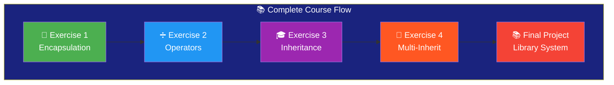
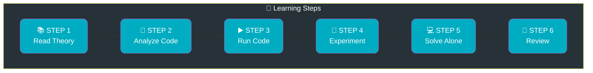
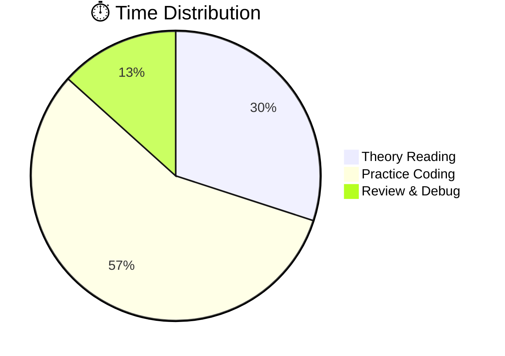
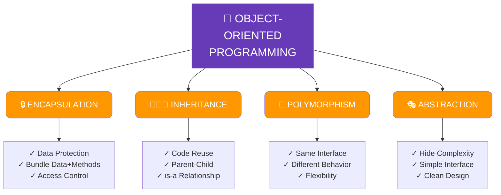
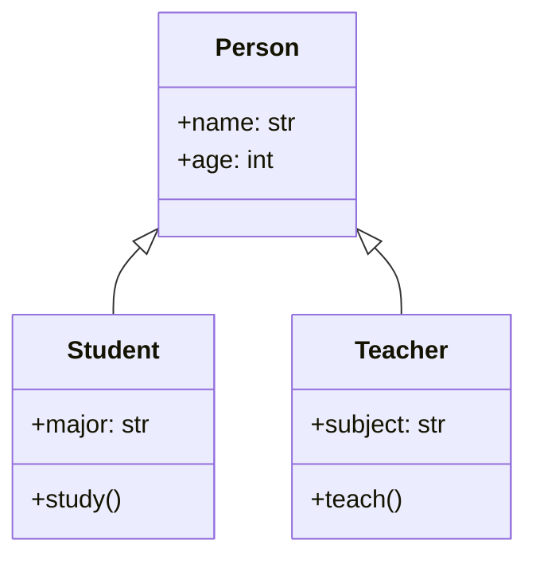
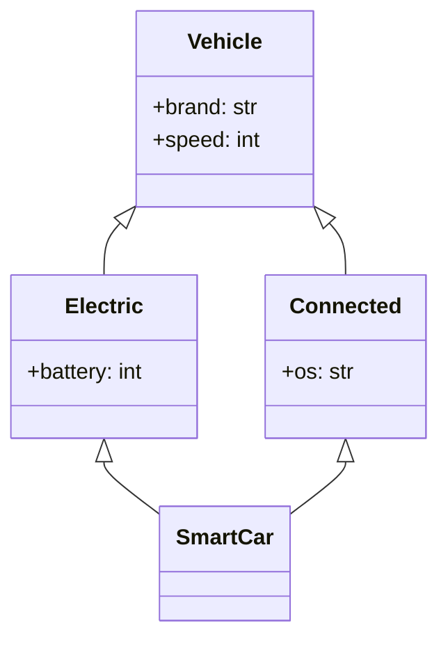
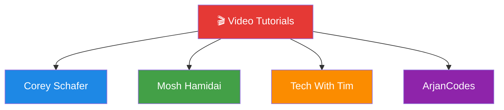
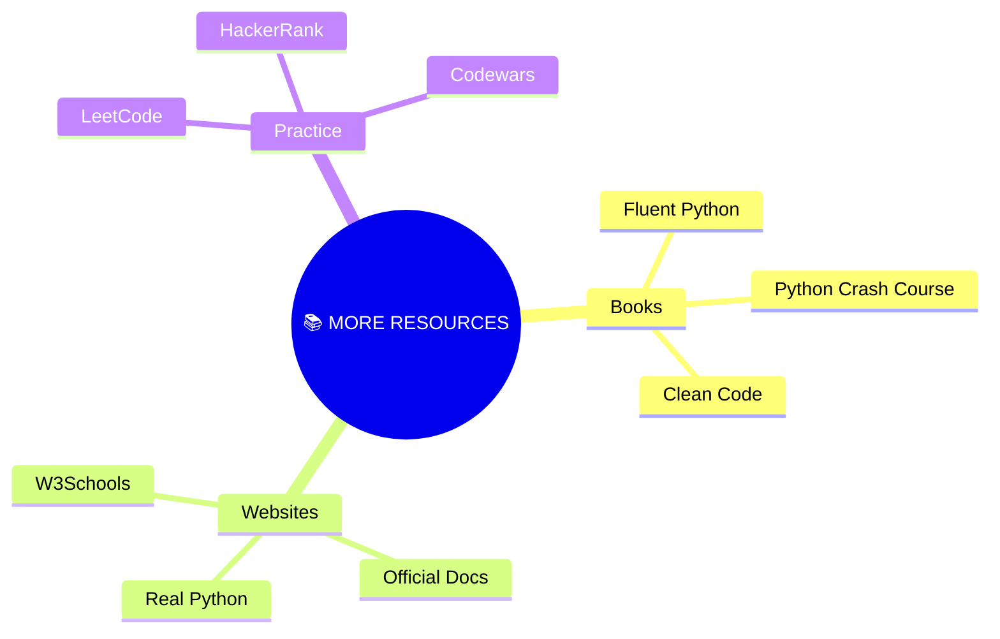

# 🐍 Ultimate Python OOP Mastery Course

<p align="center">
  <a href="https://www.python.org/">
    
  </a>
  <a href="#">
    
  </a>
  <a href="#">
    
  </a>
  <a href="#">
    
  </a>
  <a href="#">
    
  </a>
</p>

---

<p align="center">
  
</p>

---

```
██████╗ ███████╗███████╗██╗     ██╗███╗   ██╗███████╗
██╔══██╗██╔════╝██╔════╝██║     ██║████╗  ██║██╔════╝
██████╔╝█████╗  █████╗  ██║     ██║██╔██╗ ██║█████╗  
██╔══██╗██╔══╝  ██╔══╝  ██║     ██║██║╚██╗██║██╔══╝  
██║  ██║███████╗███████╗███████╗██║██║ ╚████║███████╗
╚═╝  ╚═╝╚══════╝╚══════╝╚══════╝╚═╝╚═╝  ╚═══╝╚══════╝
                                                    
 ██████╗ ███████╗██╗   ██╗
██╔════╝ ██╔════╝██║   ██║
██║  ███╗█████╗  ██║   ██║
██║   ██║██╔══╝  ╚██╗ ██╔╝
╚██████╔╝███████╗ ╚████╔╝ 
 ╚═════╝ ╚══════╝  ╚═══╝  
                                                    
    OOP MASTER COURSE 🎓
```

---

## 📑 Table of Contents

1. [🏠 Home](#1-简介)
2. [🎯 Objectives](#2-学习目标)
3. [💻 Environment](#3-环境配置)
4. [📂 Structure](#4-项目结构)
5. [📖 Methodology](#5-工作方法论)
6. [🧠 OOP Theory](#6-面向对象基础)
7. [📝 Exercises](#7-练习详解)
8. [▶️ Run Code](#8-运行练习)
9. [📊 Results](#9-预期输出)
10. [💡 Reference](#10-关键概念)
11. [🎬 Videos](#11-视频资源)
12. [❓ Help](#12-常见问题)
13. [📚 Resources](#13-附加资源)

---

## 1. 🏠 Home

```
╔══════════════════════════════════════════════════════════════════════════════╗
║                                                                              ║
║    Welcome to the Ultimate Python Object-Oriented Programming Master Course! ║
║                                                                              ║
║    This comprehensive course will take you from OOP beginner to expert.     ║
║                                                                              ║
║    🎓 What you'll master:                                                    ║
║       ✓ Classes & Objects creation                                          ║
║       ✓ Encapsulation & Data Protection                                     ║
║       ✓ Inheritance & Code Reuse                                            ║
║       ✓ Polymorphism & Operator Overloading                                 ║
║       ✓ Multiple Inheritance & MRO                                          ║
║       ✓ Complete Project Architecture                                        ║
║                                                                              ║
╚══════════════════════════════════════════════════════════════════════════════╝
```

### Course at a Glance



---

## 2. 🎯 Objectives

### Your Learning Goals

```mermaid
mindmap
  root((🎯 LEARNING GOALS))
    Master Class Design
      Create classes
      Define constructors
      Object instantiation
    Encapsulation
      Data protection
      Private attributes
      Public methods
    Inheritance
      Single inheritance
      Multiple inheritance
      super() usage
    Polymorphism
      Operator overloading
      Dunder methods
      Method overriding
    Build Projects
      Architecture design
      Complete systems
      Best practices
```

---

## 3. 💻 Environment

### System Requirements

| 🖥️ Component | 📋 Minimum | ⚡ Recommended |
|--------------|------------|----------------|
| **Python** | 3.8 | 3.12+ |
| **RAM** | 4 GB | 8 GB |
| **Storage** | 1 GB | 5 GB |
| **OS** | Windows/Mac/Linux | Win 11/Mac/Ubuntu |

### Quick Setup

```bash
# 🍎 macOS
brew install python3

# 🐧 Linux
sudo apt install python3 python3-pip

# 🪟 Windows
# Download from python.org
```

---

## 4. 📂 Project Structure

```
📦 Python-Practical-Works/
 │
 ├── 📄 README.md              ⭐ This comprehensive guide
 │
 ├── 📄 Exercise 1.py          🏦 Bank Account System
 │   ├── BankAccount class
 │   ├── Private attributes
 │   └── deposit/withdraw
 │
 ├── 📄 Exercise 2.py          ➗ Vector2D Calculator
 │   ├── Vector2D class
 │   ├── Math operations
 │   └── Dunder methods
 │
 ├── 📄 Exercise 3.py          🎓 School Management
 │   ├── Person (parent)
 │   ├── Student (child)
 │   └── Teacher (child)
 │
 ├── 📄 Exercise 4.py          🚗 Connected Vehicles
 │   ├── Vehicle (root)
 │   ├── ElectricVehicle
 │   ├── ConnectedVehicle
 │   └── ConnectedElectricCar
 │
 └── 📄 Exercise .py           📚 Library System
     ├── Document
     ├── Book/Article
     └── Library management
```

---

## 5. 📖 Methodology

### 6-Step Learning System



### Time Table



---

## 6. 🧠 OOP Theory

### The 4 Pillars



---

## 7. 📝 Exercises

### Exercise 1: Bank Account 🏦

**Level**: ⭐ Beginner

**Focus**: Encapsulation

```python
class BankAccount:
    """🏦 Banking system with data protection."""
    
    def __init__(self, holder: str, balance: float):
        self.holder = holder          # 👁️ Public
        self._bank = "Bank"          # ⚠️ Protected
        self.__balance = balance     # 🔒 Private!
    
    def deposit(self, amount: float):
        """💰 Deposit money safely."""
        if amount > 0:
            self.__balance += amount
            return f"✅ Deposited: ${amount}"
    
    def get_balance(self) -> float:
        """🔑 Get private balance."""
        return self.__balance
```

---

### Exercise 2: Vector2D ➗

**Level**: ⭐⭐ Intermediate

**Focus**: Operator Overloading

```python
class Vector2D:
    """➗ 2D vector with math operations."""
    
    def __init__(self, x: float, y: float):
        self.x = x
        self.y = y
    
    def __add__(self, other):
        """➕ Addition: v1 + v2"""
        return Vector2D(self.x + other.x, self.y + other.y)
    
    def __mul__(self, scalar: float):
        """✖️ Multiplication: v * 3"""
        return Vector2D(self.x * scalar, self.y * scalar)
```

---

### Exercise 3: School System 🎓

**Level**: ⭐⭐ Intermediate

**Focus**: Inheritance



---

### Exercise 4: Vehicles 🚗

**Level**: ⭐⭐⭐ Advanced

**Focus**: Multiple Inheritance



---

## 8. ▶️ Run Code

### Quick Commands

```bash
# 🪟 Windows
cd Python-Practical-Works
python Exercise1.py

# 🍎 macOS / 🐧 Linux
python3 Exercise1.py

# ▶️ Run All
python Exercise1.py && python Exercise2.py && python Exercise3.py && python Exercise4.py && python "Exercise .py"
```

---

## 9. 📊 Results

### Expected Outputs

#### 🏦 Exercise 1 Output
```
╔══════════════════════════════════════════════════╗
║     💰 BANK ACCOUNT SYSTEM DEMO                 ║
╠══════════════════════════════════════════════════╣
║  Account created: Account of Yasmine            ║
║  💵 Balance: 5000 MAD                           ║
║  ➕ Deposit: +2000 MAD  → Balance: 7000        ║
║  ➖ Withdrawal: -1000 MAD → Balance: 6000       ║
╚══════════════════════════════════════════════════╝
```

#### ➗ Exercise 2 Output
```
╔══════════════════════════════════════════════════╗
║       ➗ VECTOR2D CALCULATOR                     ║
╠══════════════════════════════════════════════════╣
║  v1 = (3, 4)                                    ║
║  v2 = (1, 2)                                    ║
║  ➕ v1 + v2 = (4, 6)                            ║
║  ✖️ v1 * 3 = (9, 12)                           ║
║  📐 Length = 5.00                               ║
╚══════════════════════════════════════════════════╝
```

---

## 10. 💡 Reference

### Quick Reference Cards

```mermaid
mindmap
  root((💡 KEY CONCEPTS))
    Naming
      public name
      protected _name
      private __name
    Dunder
      __init__
      __str__
      __add__
    Inheritance
      super()
      isinstance()
      __mro__
```

---

## 11. 🎬 Videos

### Learning Resources



| 📺 Topic | 🔗 Link | ⏱️ Duration |
|----------|---------|-------------|
| OOP Basics | [Watch](https://www.youtube.com/watch?v=apACNr7DC_s) | 45 min |
| Classes | [Watch](https://www.youtube.com/watch?v=8ok8hJ7D2sE) | 20 min |
| Inheritance | [Watch](https://www.youtube.com/watch?v=RSl87lqOXDE) | 25 min |
| MRO | [Watch](https://www.youtube.com/watch?v=0sD3M7EuzE4) | 30 min |

---

## 12. ❓ Help

### Common Questions

```mermaid
flowchart TD
    Q[❓ Questions] --> Q1{_ vs __?}
    Q --> Q2{When inherit?}
    Q --> Q3{What is MRO?}
    Q --> Q4{Overload ops?}
    
    Q1 --> A1[__ triggers<br/>name mangling]
    Q2 --> A2[Use for "is-a"<br/>relationships]
    Q3 --> A3[Method lookup<br/>order]
    Q4 --> A4[Yes! Use<br/>dunder methods]
    
    style Q fill:#ff9800,color:#fff
    style Q1 fill:#ffc107
    style Q2 fill:#ffc107
    style Q3 fill:#ffc107
    style Q4 fill:#ffc107
```

---

## 13. 📚 Resources

### Further Reading



---

<p align="center">
  
  ━━━━━━━━━━━━━━━━━━━━━━━━━━━━━━━━━━━━━━━━━━━━━━━━━━━━━━━━━━━━━━━━━━━━
  
  🎉 THANK YOU FOR USING THIS COURSE! 🎉
  
  ━━━━━━━━━━━━━━━━━━━━━━━━━━━━━━━━━━━━━━━━━━━━━━━━━━━━━━━━━━━━━━━━━━━━
  
  
  
  <a href="#">
    
  </a>
  
</p>

---

<p align="center">
  <strong>🚀 Happy Coding! Build Something Amazing! 🚀</strong><br>
  <em>⭐ Star this repo if you found it helpful!</em>
</p>

---
